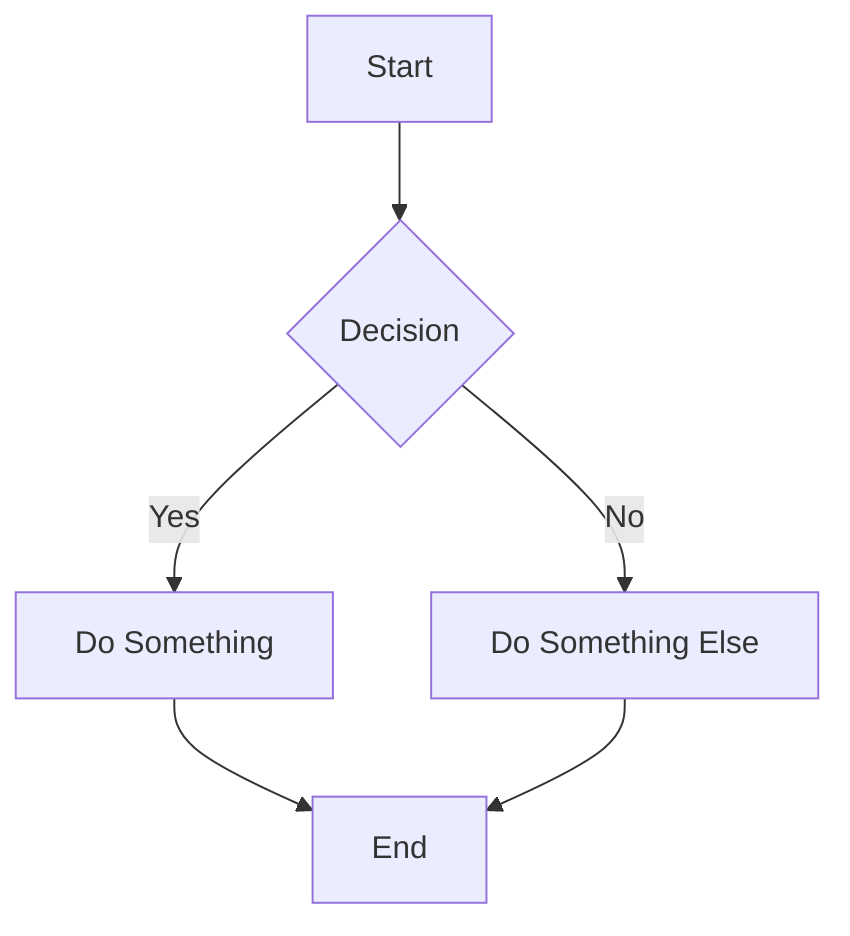

# FoldingText Web - Implementation Plan

## Executive Summary

Building a web-based version of FoldingText with these key requirements:
- **Serverless**: Runs entirely client-side
- **Storage**: IndexedDB for persistence
- **Format**: Plain text markdown (no WYSIWYG)
- **Performance**: Handle large content (CSV dumps, etc.) without slowdown
- **Core Feature**: Collapse content at ANY point (not just at headers)
- **UI**: Simplistic yet elegant
- **Rich Content**: Support images, attachments, tables, and code previews
- **Navigation**: URL-based focus navigation with hierarchical structure
- **Search**: Powerful regex search/replace with scope control
- **Export/Import**: Encrypted, compressed, header-scoped data portability

---

## 1. Application Architecture

### 1.1 Technology Stack
```
Frontend:
├── Vanilla JavaScript (ES6+ modules) - No framework overhead for performance
├── HTML5 - Semantic structure
└── CSS3 - Modern styling with CSS variables for theming

Storage:
└── IndexedDB - Asynchronous, handles large data efficiently

Optional:
├── Web Workers - For heavy parsing/processing
└── Service Worker - For offline capability (future enhancement)
```

### 1.2 File Structure
```
quick-notes/
├── index.html              # Main entry point
├── manifest.json           # PWA manifest (optional)
├── css/
│   ├── main.css           # Core styles
│   ├── editor.css         # Editor-specific styles
│   ├── themes.css         # Color themes (base + custom)
│   └── richcontent.css    # Styles for images, tables, attachments
├── js/
│   ├── main.js            # Application entry point
│   ├── modules/
│   │   ├── editor.js      # Editor controller
│   │   ├── storage.js     # IndexedDB wrapper
│   │   ├── folding.js     # Folding/collapse logic
│   │   ├── parser.js      # Markdown parsing
│   │   ├── renderer.js    # Virtual rendering engine
│   │   ├── keyboard.js    # Keyboard shortcuts
│   │   ├── search.js      # Search and replace (regex)
│   │   ├── navigation.js  # URL-based navigation
│   │   ├── export.js      # Export with encryption/compression
│   │   ├── import.js      # Import handler
│   │   ├── richcontent.js # Images, attachments, tables
│   │   ├── themes.js      # Theme management
│   │   ├── compute.js     # Inline variable computation
│   │   ├── restructure.js # Drag-drop document restructuring
│   │   └── utils.js       # Utility functions
│   └── workers/
│       ├── parser.worker.js    # Background parsing
│       ├── crypto.worker.js    # Encryption/decryption
│       └── compression.worker.js # Compression for export
└── README.md
```

### 1.3 Core Modules

**Editor Module** (`editor.js`)
- Manages the main editing surface
- Handles text input and cursor management
- Coordinates between other modules
- Implements undo/redo

**Storage Module** (`storage.js`)
- IndexedDB wrapper for document persistence
- Auto-save functionality
- Document versioning (optional)
- Import/export capabilities

**Folding Module** (`folding.js`)
- **Critical Innovation**: Arbitrary fold points
- Fold state management
- Visual indicators for folds
- Keyboard navigation through folds

**Parser Module** (`parser.js`)
- Lightweight markdown tokenization
- Line-based parsing for performance
- Incremental parsing (only re-parse changed regions)
- Structure detection (headers, lists, code blocks)

**Renderer Module** (`renderer.js`)
- Virtual scrolling for large documents
- Efficient DOM updates (only visible lines)
- Syntax highlighting for markdown
- Fold visual representation
- Selection-aware rendering (preserve lines during text selection)

**Search Module** (`search.js`)
- Regex-based search and replace
- Scope control: current header, nested headers, entire document
- Search history and incremental search
- Match highlighting

**Navigation Module** (`navigation.js`)
- URL-based focus navigation
- Header hierarchy management (directory-style paths)
- Auto-hide parent headers when focused
- Browser history integration

**Export/Import Module** (`export.js`, `import.js`)
- Header-scoped export (current section + children)
- Compression (gzip/brotli)
- Encryption (AES-256-GCM, discrete UI)
- Directory-style header selection

**Rich Content Module** (`richcontent.js`)
- Inline images with resizing
- File attachments (stored in IndexedDB)
- Graphical table rendering (togglable)
- Code block preview (especially HTML/JS)
- Preview window management

**Themes Module** (`themes.js`)
- Custom theme creation and management
- Theme persistence
- CSS variable manipulation
- Import/export themes

**Compute Module** (`compute.js`)
- Inline JavaScript variable evaluation
- Header-scoped variable system
- Expression parsing and computation
- Reactive updates when variables change
- Live result display

**Restructure Module** (`restructure.js`)
- Visual document structure view
- Drag-and-drop header reordering
- Collapsible tree visualization
- Batch operations (move sections, merge, split)

### 1.4 Deployment & CI/CD

**GitHub Pages Deployment**

The application will be deployed using GitHub Pages with automated workflows for both production and PR previews.

**Production Deployment Workflow**

`.github/workflows/deploy.yml`:
```yaml
name: Deploy to GitHub Pages

on:
  push:
    branches: [main, master]
  workflow_dispatch:

permissions:
  contents: read
  pages: write
  id-token: write

concurrency:
  group: "pages"
  cancel-in-progress: false

jobs:
  deploy:
    environment:
      name: github-pages
      url: ${{ steps.deployment.outputs.page_url }}
    runs-on: ubuntu-latest
    steps:
      - name: Checkout
        uses: actions/checkout@v4

      - name: Setup Pages
        uses: actions/configure-pages@v4

      - name: Upload artifact
        uses: actions/upload-pages-artifact@v3
        with:
          path: '.'

      - name: Deploy to GitHub Pages
        id: deployment
        uses: actions/deploy-pages@v4
```

**PR Preview Workflow**

`.github/workflows/pr-preview.yml`:
```yaml
name: PR Preview Deployment

on:
  pull_request:
    types: [opened, synchronize, reopened]
    branches: [main, master]

permissions:
  contents: read
  pull-requests: write
  pages: write

jobs:
  build-preview:
    runs-on: ubuntu-latest
    steps:
      - name: Checkout PR
        uses: actions/checkout@v4
        with:
          ref: ${{ github.event.pull_request.head.sha }}

      - name: Create preview directory
        run: |
          mkdir -p preview/pr-${{ github.event.pull_request.number }}
          cp -r * preview/pr-${{ github.event.pull_request.number }}/ 2>/dev/null || true

      - name: Deploy to preview branch
        uses: peaceiris/actions-gh-pages@v3
        with:
          github_token: ${{ secrets.GITHUB_TOKEN }}
          publish_dir: ./preview
          publish_branch: gh-pages-preview
          destination_dir: pr-${{ github.event.pull_request.number }}
          keep_files: true

      - name: Comment PR with preview link
        uses: actions/github-script@v7
        with:
          script: |
            const prNumber = context.payload.pull_request.number;
            const previewUrl = `https://${context.repo.owner}.github.io/${context.repo.repo}/pr-${prNumber}/`;

            // Find existing comment
            const comments = await github.rest.issues.listComments({
              owner: context.repo.owner,
              repo: context.repo.repo,
              issue_number: prNumber,
            });

            const botComment = comments.data.find(comment =>
              comment.user.type === 'Bot' &&
              comment.body.includes('Preview Deployment')
            );

            const commentBody = `## 🚀 Preview Deployment

            Your changes have been deployed to a preview environment:

            **Preview URL:** ${previewUrl}

            This preview will be updated automatically when you push new commits.

            ---
            *Last updated: ${new Date().toUTCString()}*
            `;

            if (botComment) {
              // Update existing comment
              await github.rest.issues.updateComment({
                owner: context.repo.owner,
                repo: context.repo.repo,
                comment_id: botComment.id,
                body: commentBody,
              });
            } else {
              // Create new comment
              await github.rest.issues.createComment({
                owner: context.repo.owner,
                repo: context.repo.repo,
                issue_number: prNumber,
                body: commentBody,
              });
            }
```

**Cleanup Workflow for Closed PRs**

`.github/workflows/pr-cleanup.yml`:
```yaml
name: Cleanup PR Preview

on:
  pull_request:
    types: [closed]

permissions:
  contents: write

jobs:
  cleanup:
    runs-on: ubuntu-latest
    steps:
      - name: Checkout preview branch
        uses: actions/checkout@v4
        with:
          ref: gh-pages-preview

      - name: Remove preview directory
        run: |
          rm -rf pr-${{ github.event.pull_request.number }}
          git config user.name github-actions
          git config user.email github-actions@github.com
          git add .
          git commit -m "Remove preview for PR #${{ github.event.pull_request.number }}" || echo "Nothing to clean"
          git push
```

**Repository Setup Requirements**

1. Enable GitHub Pages in repository settings:
   - Go to Settings > Pages
   - Source: Deploy from a branch
   - Branch: `gh-pages` (will be created automatically)
   - Path: `/` (root)

2. No additional secrets required - uses built-in `GITHUB_TOKEN`

3. PR previews use a separate branch (`gh-pages-preview`) to avoid conflicts with production deployments

**Features**

- ✅ Automatic production deployment on push to main/master
- ✅ Individual preview URLs for each PR (e.g., `username.github.io/quick-notes/pr-42/`)
- ✅ Automatic comment in PR with preview link
- ✅ Comment updates with each new commit
- ✅ Automatic cleanup when PR is closed
- ✅ No build step required (pure static files)
- ✅ Fast deployment (typically < 2 minutes)

**Alternative: Cloudflare Pages (optional)**

For users who prefer Cloudflare Pages:
- Connect repository to Cloudflare Pages
- Build command: (none - static files)
- Output directory: `/`
- Automatic PR previews built-in
- Faster global CDN
- Higher bandwidth limits

---

## 2. Data Model

### 2.1 Document Structure
```javascript
{
  id: "unique-doc-id",
  title: "Document Title",
  content: "raw markdown text",  // Plain text, newline-separated
  created: timestamp,
  modified: timestamp,
  metadata: {
    lineCount: number,
    charCount: number,
    foldCount: number,
    attachmentCount: number,
    imageCount: number
  },
  folds: [
    {
      id: "fold-uuid",
      startLine: number,        // 0-indexed line number
      endLine: number,          // 0-indexed line number
      collapsed: boolean,
      label: "optional label"   // Preview text when collapsed
    }
  ],
  attachments: [
    {
      id: "attachment-uuid",
      fileName: "document.pdf",
      mimeType: "application/pdf",
      size: number,             // bytes
      data: ArrayBuffer,        // Binary data
      lineNumber: number,       // Where it's referenced in content
      thumbnail: "base64..."    // Optional preview image
    }
  ],
  images: [
    {
      id: "image-uuid",
      fileName: "photo.jpg",
      data: "base64..." or ArrayBuffer,
      width: number,            // Display width (can be resized)
      height: number,           // Display height
      originalWidth: number,
      originalHeight: number,
      lineNumber: number
    }
  ],
  cursor: {
    line: number,
    column: number
  },
  scroll: {
    top: number
  },
  focusedHeader: {
    path: "/Header 1/Subheader 2",  // Directory-style path
    lineNumber: number
  }
}
```

### 2.2 IndexedDB Schema
```javascript
Database: "FoldingTextDB"
Version: 1

Object Stores:
├── documents
│   ├── keyPath: "id"
│   └── indexes: ["modified", "title"]
│
├── attachments
│   ├── keyPath: "id"
│   └── indexes: ["documentId", "fileName"]
│
├── images
│   ├── keyPath: "id"
│   └── indexes: ["documentId"]
│
├── themes
│   ├── keyPath: "id"
│   └── Custom theme definitions
│
├── settings
│   └── keyPath: "key"
│
└── autosave
    ├── keyPath: "id"
    └── Temporary storage for recovery
```

### 2.3 In-Memory Representation
For performance, maintain in-memory structures:
```javascript
{
  lines: [                    // Array of line objects
    {
      text: "line content",
      lineNumber: number,
      tokens: [],             // Parsed markdown tokens
      isFoldStart: boolean,
      isFoldEnd: boolean,
      isHidden: boolean,      // Hidden by parent fold
      foldId: "fold-uuid"     // If part of a fold
    }
  ],
  visibleLines: [],           // Indexes of visible lines
  foldMap: Map(),            // foldId -> fold object
  lineToFoldMap: Map()       // lineNumber -> foldId[]
}
```

---

## 3. Folding/Collapsing Mechanism

### 3.1 The Innovation: Arbitrary Folding
Unlike traditional outliners that only fold at headers, this implementation allows:
- **Selection-based folding**: Select any range and fold it
- **Smart folding**: Auto-detect foldable regions (headers, lists, code blocks)
- **Inline folding**: Collapse in the middle of content without scrolling

### 3.2 Folding Behavior
```
User Actions:
1. Manual Selection Fold
   - Select text (multiple lines)
   - Press fold shortcut (Cmd/Ctrl + .)
   - Creates fold from selection start to end

2. Smart Fold
   - Cursor on header line → fold entire section
   - Cursor in list → fold list items
   - Cursor in code block → fold block
   - Cursor anywhere → fold paragraph

3. Fold All/Unfold All
   - Collapse all headers
   - Collapse all code blocks
   - Expand everything

Visual Representation:
┌─────────────────────────────────┐
│ # Header 1                      │
│ Some content...                 │
│ ▶ [Lines 3-15 collapsed] ...    │ ← Fold indicator
│ More content after fold         │
│ ## Header 2                     │
└─────────────────────────────────┘
```

### 3.3 Fold Management
```javascript
class FoldManager {
  createFold(startLine, endLine, label?)
  removeFold(foldId)
  toggleFold(foldId)
  getFoldsInRange(startLine, endLine)
  getVisibleLines()
  navigateToNextFold()
  navigateToPreviousFold()
}
```

### 3.4 Edge Cases
- Nested folds: Allow folds within folds
- Overlapping folds: Prevent or merge
- Editing folded content: Auto-expand or edit in-place
- Moving/deleting folded regions: Update fold boundaries

### 3.5 Header Copy/Paste

**Smart Header Clipboard Operations**

Traditional copy/paste requires manually selecting entire sections. This feature enables one-click copying of headers with all their nested content.

**Behavior**

When the cursor is on a header line:
- `Cmd/Ctrl + Shift + C`: Copy entire header and all nested content (including sub-headers, their content, and everything until the next same-level or higher-level header)
- `Cmd/Ctrl + Shift + X`: Cut entire header and all nested content
- `Cmd/Ctrl + Shift + V`: Paste as structured content (preserves indentation and hierarchy)

**Implementation**

```javascript
class HeaderClipboard {
  constructor(editor, parser) {
    this.editor = editor
    this.parser = parser
    this.clipboard = null
  }

  copyHeader(cursorLine) {
    const header = this.findHeaderAtLine(cursorLine)
    if (!header) {
      // Fallback to normal copy if not on a header
      document.execCommand('copy')
      return
    }

    const { startLine, endLine, level, title } = header
    const content = this.extractHeaderContent(startLine, endLine)

    // Store in both custom clipboard and system clipboard
    this.clipboard = {
      type: 'header',
      level: level,
      title: title,
      content: content,
      lineCount: endLine - startLine + 1
    }

    // Copy to system clipboard as plain text
    this.copyToSystemClipboard(content)

    // Visual feedback
    this.showCopyFeedback(startLine, endLine)
  }

  cutHeader(cursorLine) {
    this.copyHeader(cursorLine)
    if (this.clipboard && this.clipboard.type === 'header') {
      const header = this.findHeaderAtLine(cursorLine)
      this.editor.deleteLines(header.startLine, header.endLine)
    }
  }

  pasteHeader(cursorLine) {
    if (!this.clipboard || this.clipboard.type !== 'header') {
      // Fallback to normal paste
      document.execCommand('paste')
      return
    }

    // Paste at cursor position
    const lines = this.clipboard.content.split('\n')
    this.editor.insertLines(cursorLine, lines)

    // Visual feedback
    this.showPasteFeedback(cursorLine, cursorLine + lines.length - 1)
  }

  findHeaderAtLine(lineNumber) {
    const line = this.editor.getLine(lineNumber)
    const headerMatch = line.match(/^(#{1,6})\s+(.+)/)

    if (!headerMatch) return null

    const level = headerMatch[1].length
    const title = headerMatch[2]

    // Find the end of this header's content
    const endLine = this.findHeaderEnd(lineNumber, level)

    return {
      startLine: lineNumber,
      endLine: endLine,
      level: level,
      title: title
    }
  }

  findHeaderEnd(startLine, headerLevel) {
    const totalLines = this.editor.getLineCount()

    // Scan forward until we hit a same-level or higher-level header
    for (let i = startLine + 1; i < totalLines; i++) {
      const line = this.editor.getLine(i)
      const nextHeaderMatch = line.match(/^(#{1,6})\s+/)

      if (nextHeaderMatch) {
        const nextLevel = nextHeaderMatch[1].length
        if (nextLevel <= headerLevel) {
          // Found same-level or higher-level header
          return i - 1
        }
      }
    }

    // No next header found, goes to end of document
    return totalLines - 1
  }

  extractHeaderContent(startLine, endLine) {
    const lines = []
    for (let i = startLine; i <= endLine; i++) {
      lines.push(this.editor.getLine(i))
    }
    return lines.join('\n')
  }

  copyToSystemClipboard(text) {
    // Create temporary textarea for clipboard access
    const textarea = document.createElement('textarea')
    textarea.value = text
    textarea.style.position = 'fixed'
    textarea.style.opacity = '0'
    document.body.appendChild(textarea)
    textarea.select()
    document.execCommand('copy')
    document.body.removeChild(textarea)
  }

  showCopyFeedback(startLine, endLine) {
    // Briefly highlight the copied region
    const lineCount = endLine - startLine + 1
    this.editor.flashLines(startLine, endLine, 'copy-highlight', 300)
    this.editor.showToast(`Copied header with ${lineCount} lines`)
  }

  showPasteFeedback(startLine, endLine) {
    this.editor.flashLines(startLine, endLine, 'paste-highlight', 300)
    this.editor.showToast(`Pasted header structure`)
  }
}
```

**Usage Examples**

```
Before (cursor on line 5):
1  # Project Ideas
2
3  Some intro text...
4
5  ## Web App Ideas          ← cursor here
6
7  ### Todo App
8  - Feature 1
9  - Feature 2
10
11 ### Notes App
12 - Feature A
13 - Feature B
14
15 ## Mobile App Ideas
16 ...

After Cmd/Ctrl + Shift + C (copy):
→ Lines 5-13 copied to clipboard:
  "## Web App Ideas

  ### Todo App
  - Feature 1
  - Feature 2

  ### Notes App
  - Feature A
  - Feature B"

Paste at line 20:
→ Entire structure inserted, preserving all nested headers
```

**Smart Detection**

- **Header Level Detection**: Automatically detects header level (# through ######)
- **Boundary Detection**: Finds the exact end of the header's scope
- **Nested Headers**: Includes all sub-headers and their content
- **Indentation Preservation**: Maintains all formatting, lists, and code blocks
- **Fold-Aware**: Works correctly even when parts of the header are folded

**Edge Cases**

- Cursor not on header: Falls back to standard copy/paste behavior
- Last header in document: Copies until end of document
- Empty headers: Copies just the header line
- Folded content: Includes folded lines in the copy
- Cut on last header: Leaves cursor at previous line

**Visual Feedback**

- Brief highlight animation on copied region (300ms green tint)
- Toast notification showing line count: "Copied header with 47 lines"
- Paste animation showing inserted content (300ms blue tint)

**Benefits**

- No need to carefully select entire sections
- One keystroke to copy complex nested structures
- Faster document reorganization
- Prevents accidental partial copies
- Works seamlessly with undo/redo

---

## 4. Search & Replace

### 4.1 Powerful Regex Search
Full-featured search with scope control and regex support:

```javascript
class SearchEngine {
  constructor(document) {
    this.document = document
    this.currentMatches = []
    this.currentMatchIndex = 0
  }

  search(pattern, options = {}) {
    const {
      regex = false,        // Enable regex patterns
      caseSensitive = false,
      scope = 'document',   // 'document', 'header', 'nested'
      headerPath = null     // For header/nested scope
    } = options

    const searchRange = this.getSearchRange(scope, headerPath)
    const flags = caseSensitive ? 'g' : 'gi'
    const searchRegex = regex ? new RegExp(pattern, flags) : new RegExp(this.escapeRegex(pattern), flags)

    this.currentMatches = this.findMatches(searchRegex, searchRange)
    return this.currentMatches
  }

  replace(pattern, replacement, options = {}) {
    // Similar to search, but with replacement logic
    // Supports regex capture groups ($1, $2, etc.)
  }

  replaceAll(pattern, replacement, options = {}) {
    // Replace all matches within scope
  }

  getSearchRange(scope, headerPath) {
    switch (scope) {
      case 'document':
        return { start: 0, end: this.document.lines.length }
      case 'header':
        // Only direct children of current header
        return this.getHeaderRange(headerPath, false)
      case 'nested':
        // Current header and all nested subheaders
        return this.getHeaderRange(headerPath, true)
    }
  }

  getHeaderRange(headerPath, includeNested) {
    // Parse path like "/Header 1/Subheader 2"
    // Find header line number
    // Determine end based on next header of same or higher level
    // If includeNested, include all subheaders
  }
}
```

### 4.2 Search UI
```
┌────────────────────────────────────────┐
│ Search: /api.*error/gi           [×]   │
│ Replace: $1_fixed                      │
│                                        │
│ Scope: [Document ▼] [Regex ✓] [Aa]   │
│   • Document (entire file)             │
│   • Current Header                     │
│   • Nested (current + subheaders)      │
│                                        │
│ 24 matches found                       │
│ [Replace] [Replace All] [Next] [Prev]  │
└────────────────────────────────────────┘
```

### 4.3 Search Scope Examples
```
Document structure:
# Project Overview
  Some text with "api"
  ## Backend API
    API documentation with "api"
    ### Error Handling
      Error codes with "api"
  ## Frontend
    Frontend "api" calls

Current header: "/Project Overview/Backend API"

Scope "header":     Only "API documentation with api"
Scope "nested":     API documentation + Error Handling section
Scope "document":   All occurrences
```

---

## 5. URL-Based Focus Navigation

### 5.1 Hierarchical Navigation
Navigate and focus on specific sections using URL parameters:

```
URL Structure:
https://app.com/#/document/abc123?focus=/Header1/Subheader2

Components:
- Document ID: abc123
- Focus path: /Header1/Subheader2 (directory-style)
```

### 5.2 Focus Behavior
When focused on a header:
1. **Hide parent/sibling headers** above the focused section
2. **Show the focused header** and all content below it
3. **Update URL** in browser address bar
4. **Enable navigation**: Browser back/forward buttons work
5. **Shareable**: URL can be copied and shared

```javascript
class NavigationManager {
  focusHeader(headerPath) {
    // Parse path: "/Header 1/Subheader 2"
    const headerLine = this.findHeaderByPath(headerPath)

    // Calculate visible range
    const visibleRange = {
      start: headerLine,
      end: this.findNextSameOrHigherLevelHeader(headerLine)
    }

    // Update render state
    this.renderer.setVisibleRange(visibleRange)

    // Update URL
    const url = new URL(window.location)
    url.searchParams.set('focus', headerPath)
    history.pushState({ focus: headerPath }, '', url)

    // Scroll to focused header
    this.scrollToLine(headerLine)
  }

  findHeaderByPath(path) {
    // Split path: "/Header 1/Subheader 2" → ["Header 1", "Subheader 2"]
    const parts = path.split('/').filter(Boolean)

    let currentLine = 0
    for (const headerText of parts) {
      currentLine = this.findNextHeader(headerText, currentLine)
      if (currentLine === -1) return null
    }
    return currentLine
  }

  buildHeaderPath(lineNumber) {
    // Build path from document root to header at lineNumber
    // Example: line 42 → "/Project/API/Endpoints"
    const headers = this.getHeaderHierarchy(lineNumber)
    return '/' + headers.map(h => h.text).join('/')
  }
}
```

### 5.3 Directory-Style Paths Throughout App
Use consistent path syntax everywhere:

**Navigation breadcrumbs:**
```
Home > Project Overview > Backend API > Error Handling
```

**Export dialog:**
```
Export from: [/Project Overview/Backend API     ▼]
  /Project Overview
  /Project Overview/Backend API
  /Project Overview/Backend API/Error Handling
  /Project Overview/Frontend
```

**Search scope:**
```
Search in: [Current Header (/Backend API)       ▼]
```

### 5.4 URL State Management
```javascript
// On page load
window.addEventListener('load', () => {
  const url = new URL(window.location)
  const focusPath = url.searchParams.get('focus')
  if (focusPath) {
    navigation.focusHeader(focusPath)
  }
})

// Handle browser back/forward
window.addEventListener('popstate', (e) => {
  if (e.state?.focus) {
    navigation.focusHeader(e.state.focus)
  }
})
```

---

## 6. Rich Content Support

### 6.1 Inline Images
Support markdown image syntax with enhancements:

```markdown

{width=500}  <!-- Custom width -->
  <!-- Base64 embedded -->
```

**Features:**
- Drag & drop image upload
- Paste images from clipboard
- Resize handles on images
- Store in IndexedDB (no external dependencies)
- Lazy loading for performance

```javascript
class ImageHandler {
  async insertImage(file, lineNumber) {
    // Convert to base64 or ArrayBuffer
    const data = await this.readFile(file)

    // Store in IndexedDB
    const imageId = uuid()
    await db.images.add({
      id: imageId,
      fileName: file.name,
      data: data,
      width: null,  // Use original size initially
      height: null,
      originalWidth: img.naturalWidth,
      originalHeight: img.naturalHeight,
      lineNumber: lineNumber
    })

    // Insert markdown reference
    const markdown = ``
    this.editor.insertText(markdown, lineNumber)
  }

  renderImage(imageId, maxWidth = 800) {
    const img = await db.images.get(imageId)
    const el = document.createElement('img')
    el.src = typeof img.data === 'string' ? img.data : this.arrayBufferToBase64(img.data)
    el.style.maxWidth = img.width ? `${img.width}px` : `${maxWidth}px`

    // Add resize handles
    this.addResizeHandles(el, imageId)

    return el
  }

  addResizeHandles(imgEl, imageId) {
    // Add corner handles for resizing
    // On resize, update IndexedDB with new dimensions
  }
}
```

### 6.2 File Attachments
Attach any file type to the document:

```markdown
[📎 document.pdf](attachment:uuid-here)
[📎 data.xlsx](attachment:uuid-here)
```

```javascript
class AttachmentHandler {
  async attachFile(file, lineNumber) {
    const attachmentId = uuid()
    const data = await file.arrayBuffer()

    await db.attachments.add({
      id: attachmentId,
      fileName: file.name,
      mimeType: file.type,
      size: file.size,
      data: data,
      lineNumber: lineNumber,
      thumbnail: await this.generateThumbnail(file)
    })

    // Insert markdown link
    const icon = this.getFileIcon(file.type)
    const markdown = `[${icon} ${file.name}](attachment:${attachmentId})`
    this.editor.insertText(markdown, lineNumber)
  }

  async downloadAttachment(attachmentId) {
    const attachment = await db.attachments.get(attachmentId)
    const blob = new Blob([attachment.data], { type: attachment.mimeType })
    const url = URL.createObjectURL(blob)

    const a = document.createElement('a')
    a.href = url
    a.download = attachment.fileName
    a.click()

    URL.revokeObjectURL(url)
  }
}
```

### 6.3 Graphical Table Rendering
Render markdown tables as pretty, interactive tables:

```markdown
| Header 1 | Header 2 | Header 3 |
|----------|----------|----------|
| Cell 1   | Cell 2   | Cell 3   |
| Cell 4   | Cell 5   | Cell 6   |
```

**Rendering Modes:**
1. **Text mode**: Plain markdown (default for large tables)
2. **Graphical mode**: Styled HTML table (toggle with button)

```javascript
class TableRenderer {
  parseTable(lines) {
    // Parse markdown table syntax
    // Return structured data
    return {
      headers: ['Header 1', 'Header 2', 'Header 3'],
      rows: [
        ['Cell 1', 'Cell 2', 'Cell 3'],
        ['Cell 4', 'Cell 5', 'Cell 6']
      ],
      alignment: ['left', 'center', 'right']
    }
  }

  renderGraphicalTable(tableData) {
    // Create styled HTML table
    const table = document.createElement('table')
    table.className = 'rendered-table'

    // Add header row
    const thead = table.createTHead()
    const headerRow = thead.insertRow()
    tableData.headers.forEach((header, i) => {
      const th = document.createElement('th')
      th.textContent = header
      th.style.textAlign = tableData.alignment[i]
      headerRow.appendChild(th)
    })

    // Add data rows
    const tbody = table.createTBody()
    tableData.rows.forEach(row => {
      const tr = tbody.insertRow()
      row.forEach((cell, i) => {
        const td = tr.insertCell()
        td.textContent = cell
        td.style.textAlign = tableData.alignment[i]
      })
    })

    // Add toggle button
    const container = document.createElement('div')
    container.className = 'table-container'
    container.appendChild(this.createToggleButton())
    container.appendChild(table)

    return container
  }

  createToggleButton() {
    const btn = document.createElement('button')
    btn.textContent = '⇄ View as Text'
    btn.onclick = () => this.toggleTableMode()
    return btn
  }
}
```

### 6.4 Code Block Previews
Support syntax-highlighted code blocks with live preview for HTML:

````markdown
```javascript
console.log('Hello, world!')
```

```html
<div style="color: red;">
  <h1>Preview Me!</h1>
  <button onclick="alert('Hello!')">Click</button>
</div>
```
````

```javascript
class CodeBlockRenderer {
  renderCodeBlock(code, language) {
    const container = document.createElement('div')
    container.className = 'code-block'

    // Syntax highlighting
    const pre = document.createElement('pre')
    const codeEl = document.createElement('code')
    codeEl.className = `language-${language}`
    codeEl.textContent = code
    pre.appendChild(codeEl)

    // Add preview button for HTML/JS
    if (language === 'html' || language === 'javascript') {
      const previewBtn = document.createElement('button')
      previewBtn.textContent = '👁 Preview'
      previewBtn.onclick = () => this.openPreview(code, language)
      container.appendChild(previewBtn)
    }

    container.appendChild(pre)
    return container
  }

  openPreview(code, language) {
    // Create resizable preview window
    const preview = document.createElement('div')
    preview.className = 'preview-window'
    preview.style.cssText = `
      position: fixed;
      bottom: 20px;
      right: 20px;
      width: 400px;
      height: 300px;
      border: 2px solid var(--border);
      background: white;
      resize: both;
      overflow: auto;
      box-shadow: 0 4px 12px rgba(0,0,0,0.15);
      z-index: 1000;
    `

    // Create iframe for isolated HTML
    if (language === 'html') {
      const iframe = document.createElement('iframe')
      iframe.style.cssText = 'width: 100%; height: 100%; border: none;'
      preview.appendChild(iframe)

      // Write HTML to iframe
      iframe.contentDocument.open()
      iframe.contentDocument.write(code)
      iframe.contentDocument.close()
    }

    // Add close button
    const closeBtn = document.createElement('button')
    closeBtn.textContent = '×'
    closeBtn.style.cssText = 'position: absolute; top: 5px; right: 5px;'
    closeBtn.onclick = () => preview.remove()
    preview.appendChild(closeBtn)

    document.body.appendChild(preview)
  }
}
```

**Preview Window Features:**
- Resizable (CSS resize property)
- Draggable
- Isolated execution (iframe sandbox)
- Multiple preview windows can be open
- Useful for creating "mini apps" within notes
- **Debug Console**: Shows `console.log()`, `alert()`, and errors

### 6.5 Mermaid Diagram Rendering
Support Mermaid diagrams for flowcharts, sequence diagrams, and more:

````markdown

````

**Features:**
- Toggle between source and rendered view
- Resizable diagram container
- Export diagram as SVG/PNG
- Support all Mermaid diagram types

```javascript
class MermaidRenderer {
  constructor() {
    this.mermaidLoaded = false
    this.loadMermaid()
  }

  async loadMermaid() {
    if (!this.mermaidLoaded) {
      // Load Mermaid.js library dynamically
      const script = document.createElement('script')
      script.src = 'https://cdn.jsdelivr.net/npm/mermaid/dist/mermaid.min.js'
      script.onload = () => {
        mermaid.initialize({ startOnLoad: false, theme: 'default' })
        this.mermaidLoaded = true
      }
      document.head.appendChild(script)
    }
  }

  renderDiagram(code, containerId) {
    const container = document.createElement('div')
    container.className = 'mermaid-container'
    container.style.cssText = `
      border: 1px solid var(--border);
      padding: 1rem;
      background: var(--bg-secondary);
      resize: both;
      overflow: auto;
      min-width: 300px;
      min-height: 200px;
    `

    // Create controls
    const controls = document.createElement('div')
    controls.className = 'mermaid-controls'
    controls.innerHTML = `
      <button class="toggle-source">⇄ View Source</button>
      <button class="resize-reset">↺ Reset Size</button>
      <button class="export-svg">💾 Export SVG</button>
    `

    // Create diagram element
    const diagramEl = document.createElement('div')
    diagramEl.className = 'mermaid-diagram'
    diagramEl.id = containerId

    // Render with Mermaid
    try {
      mermaid.render(containerId, code, (svgCode) => {
        diagramEl.innerHTML = svgCode
      })
    } catch (e) {
      diagramEl.innerHTML = `<pre style="color: red;">Error rendering diagram:\n${e.message}</pre>`
    }

    // Source view (hidden by default)
    const sourceEl = document.createElement('pre')
    sourceEl.className = 'mermaid-source'
    sourceEl.style.display = 'none'
    sourceEl.textContent = code

    container.appendChild(controls)
    container.appendChild(diagramEl)
    container.appendChild(sourceEl)

    // Set up toggle
    controls.querySelector('.toggle-source').onclick = () => {
      const isShowingSource = sourceEl.style.display !== 'none'
      diagramEl.style.display = isShowingSource ? 'block' : 'none'
      sourceEl.style.display = isShowingSource ? 'none' : 'block'
      controls.querySelector('.toggle-source').textContent =
        isShowingSource ? '⇄ View Source' : '⇄ View Diagram'
    }

    // Reset size
    controls.querySelector('.resize-reset').onclick = () => {
      container.style.width = 'auto'
      container.style.height = 'auto'
    }

    // Export SVG
    controls.querySelector('.export-svg').onclick = () => {
      const svg = diagramEl.querySelector('svg')
      if (svg) {
        const svgData = new XMLSerializer().serializeToString(svg)
        const blob = new Blob([svgData], { type: 'image/svg+xml' })
        const url = URL.createObjectURL(blob)
        const a = document.createElement('a')
        a.href = url
        a.download = 'diagram.svg'
        a.click()
        URL.revokeObjectURL(url)
      }
    }

    return container
  }
}
```

**Supported Diagram Types:**
- Flowcharts (`graph TD`, `graph LR`)
- Sequence diagrams
- Class diagrams
- State diagrams
- Entity Relationship diagrams
- Gantt charts
- Pie charts
- Git graphs

### 6.6 Interactive Checkboxes
Support interactive todo lists with clickable checkboxes:

```markdown
- [ ] Incomplete task
- [x] Completed task
- [ ] Another task
  - [x] Nested completed subtask
  - [ ] Nested incomplete subtask
```

**Features:**
- Click checkbox to toggle completion
- Persist checkbox state in document content
- Visual styling for completed items (strikethrough)
- Progress indicator for nested lists

```javascript
class CheckboxHandler {
  renderCheckbox(checked, lineNumber) {
    const checkbox = document.createElement('input')
    checkbox.type = 'checkbox'
    checkbox.checked = checked
    checkbox.className = 'task-checkbox'
    checkbox.dataset.line = lineNumber

    checkbox.onclick = (e) => {
      e.stopPropagation()
      this.toggleCheckbox(lineNumber, checkbox.checked)
    }

    return checkbox
  }

  toggleCheckbox(lineNumber, newState) {
    // Update document content
    const line = this.document.lines[lineNumber]
    if (newState) {
      // Mark as complete: [ ] → [x]
      line.text = line.text.replace(/- \[ \]/, '- [x]')
    } else {
      // Mark as incomplete: [x] → [ ]
      line.text = line.text.replace(/- \[x\]/, '- [ ]')
    }

    // Update visual rendering
    this.updateLineRendering(lineNumber)

    // Trigger auto-save
    this.document.save()

    // Update progress indicators if nested
    this.updateProgressIndicators(lineNumber)
  }

  parseCheckbox(text) {
    // Detect checkbox syntax: - [ ] or - [x]
    const match = text.match(/^(\s*)-\s\[([ x])\]\s(.+)/)
    if (match) {
      const [, indent, state, taskText] = match
      return {
        isCheckbox: true,
        checked: state === 'x',
        indent: indent.length,
        text: taskText
      }
    }
    return { isCheckbox: false }
  }

  renderTaskItem(lineData, lineNumber) {
    const container = document.createElement('div')
    container.className = 'task-item'

    const checkbox = this.renderCheckbox(lineData.checked, lineNumber)
    const label = document.createElement('label')
    label.textContent = lineData.text
    label.style.paddingLeft = `${lineData.indent * 20}px`

    if (lineData.checked) {
      label.style.textDecoration = 'line-through'
      label.style.opacity = '0.6'
    }

    container.appendChild(checkbox)
    container.appendChild(label)

    return container
  }

  updateProgressIndicators(lineNumber) {
    // Find parent checkbox (if exists)
    const parentLine = this.findParentCheckbox(lineNumber)
    if (parentLine !== -1) {
      // Count completed vs total subtasks
      const { completed, total } = this.countSubtasks(parentLine)

      // Show progress indicator
      const progressEl = document.querySelector(`[data-line="${parentLine}"] .progress`)
      if (progressEl) {
        progressEl.textContent = `${completed}/${total}`

        // Auto-check parent if all subtasks complete
        if (completed === total && total > 0) {
          const parentCheckbox = document.querySelector(`[data-line="${parentLine}"]`)
          if (parentCheckbox && !parentCheckbox.checked) {
            parentCheckbox.checked = true
            this.toggleCheckbox(parentLine, true)
          }
        }
      }
    }
  }

  countSubtasks(parentLine) {
    const parentIndent = this.getIndentLevel(parentLine)
    let completed = 0
    let total = 0

    // Scan following lines until we exit the parent's scope
    for (let i = parentLine + 1; i < this.document.lines.length; i++) {
      const line = this.document.lines[i]
      const indent = this.getIndentLevel(i)

      // Exit if we're back at parent level or higher
      if (indent <= parentIndent) break

      const checkboxData = this.parseCheckbox(line.text)
      if (checkboxData.isCheckbox && indent === parentIndent + 1) {
        total++
        if (checkboxData.checked) completed++
      }
    }

    return { completed, total }
  }
}
```

**Visual Styling:**
```css
.task-checkbox {
  margin-right: 0.5rem;
  cursor: pointer;
  width: 16px;
  height: 16px;
}

.task-item {
  display: flex;
  align-items: center;
  padding: 0.25rem 0;
}

.task-item label {
  cursor: pointer;
  flex: 1;
}

.task-item .progress {
  margin-left: auto;
  font-size: 0.85em;
  color: var(--text-secondary);
  padding: 0.1rem 0.4rem;
  background: var(--bg-secondary);
  border-radius: 3px;
}
```

---

## 7. Export & Import with Encryption

### 7.1 Export Features
**Scope-based export:**
- Export current header and all nested content
- Select any header from dropdown (directory-style paths)
- Includes all attachments and images referenced in scope

**Compression:**
- Use gzip or brotli for efficient file size
- Large attachments are compressed separately

**Encryption (Discrete):**
- AES-256-GCM encryption
- Password-based key derivation (PBKDF2)
- Encryption happens silently (no obvious UI indicator)
- When exporting, user provides password
- Export file is `.ftx` (FoldingText Export)

```javascript
class ExportManager {
  async export(options = {}) {
    const {
      headerPath = '/',           // Root = entire document
      includeAttachments = true,
      password = null,            // If provided, encrypt
      compression = 'gzip'
    } = options

    // 1. Get content scope
    const content = this.getContentByPath(headerPath)

    // 2. Collect referenced images/attachments
    const assets = includeAttachments ? await this.collectAssets(content) : []

    // 3. Create export bundle
    const bundle = {
      version: '1.0',
      exported: Date.now(),
      headerPath: headerPath,
      content: content,
      assets: assets,
      metadata: {
        lineCount: content.split('\n').length,
        assetCount: assets.length
      }
    }

    // 4. Serialize to JSON
    let data = JSON.stringify(bundle)

    // 5. Compress
    const compressed = await this.compress(data, compression)

    // 6. Encrypt if password provided
    let finalData = compressed
    if (password) {
      finalData = await this.encrypt(compressed, password)
    }

    // 7. Download
    const blob = new Blob([finalData], { type: 'application/octet-stream' })
    const fileName = this.generateFileName(headerPath, password != null)
    this.download(blob, fileName)
  }

  async encrypt(data, password) {
    // Use Web Crypto API
    const salt = crypto.getRandomValues(new Uint8Array(16))
    const iv = crypto.getRandomValues(new Uint8Array(12))

    // Derive key from password
    const keyMaterial = await crypto.subtle.importKey(
      'raw',
      new TextEncoder().encode(password),
      { name: 'PBKDF2' },
      false,
      ['deriveBits', 'deriveKey']
    )

    const key = await crypto.subtle.deriveKey(
      {
        name: 'PBKDF2',
        salt: salt,
        iterations: 100000,
        hash: 'SHA-256'
      },
      keyMaterial,
      { name: 'AES-GCM', length: 256 },
      false,
      ['encrypt']
    )

    // Encrypt
    const encrypted = await crypto.subtle.encrypt(
      { name: 'AES-GCM', iv: iv },
      key,
      data
    )

    // Prepend salt and IV for decryption
    const result = new Uint8Array(salt.length + iv.length + encrypted.byteLength)
    result.set(salt, 0)
    result.set(iv, salt.length)
    result.set(new Uint8Array(encrypted), salt.length + iv.length)

    return result
  }

  generateFileName(headerPath, encrypted) {
    const headerName = headerPath.split('/').filter(Boolean).pop() || 'document'
    const sanitized = headerName.replace(/[^a-z0-9]/gi, '_').toLowerCase()
    const timestamp = new Date().toISOString().split('T')[0]
    const ext = encrypted ? 'ftx' : 'ftx'  // Same extension, discrete encryption
    return `${sanitized}_${timestamp}.${ext}`
  }
}
```

### 7.2 Enhanced Import System
**Three Import Scenarios:**

1. **Backup & Recover**: Import as new document (preserve original)
2. **Sync**: Detect previous import and update existing content
3. **Inject**: Insert content at specific location in current document

**Features:**
- Auto-detect if content was previously imported (via environment ID)
- Show clear status messages ("Previous import detected, content will be synced")
- Allow override from sync to inject mode
- Flexible insertion point selection

```javascript
class ImportManager {
  constructor() {
    this.importHistory = new Map() // Track imported content
  }

  async import(file, password = null, mode = 'auto') {
    // 1. Read and decrypt file
    const bundle = await this.loadBundle(file, password)

    // 2. Generate environment ID for this import
    if (!bundle.environmentId) {
      bundle.environmentId = this.generateEnvironmentId(bundle)
    }

    // 3. Check if previously imported
    const previousImport = await this.findPreviousImport(bundle.environmentId)

    // 4. Determine import mode
    let importMode = mode
    if (mode === 'auto') {
      importMode = previousImport ? 'sync' : 'backup'
    }

    // 5. Show confirmation dialog
    const confirmation = await this.showImportDialog(bundle, previousImport, importMode)
    if (!confirmation.proceed) return null

    // 6. Execute import based on mode
    switch (confirmation.mode) {
      case 'backup':
        return await this.importAsBackup(bundle)
      case 'sync':
        return await this.importAsSync(bundle, previousImport)
      case 'inject':
        return await this.importAsInject(bundle, confirmation.insertionPoint)
    }
  }

  async loadBundle(file, password) {
    const data = await file.arrayBuffer()

    // Try to decrypt if password provided
    let decrypted = data
    if (password) {
      try {
        decrypted = await this.decrypt(data, password)
      } catch (e) {
        // Try without password (might not be encrypted)
        try {
          decrypted = await this.decompress(data)
        } catch {
          throw new Error('Incorrect password or corrupted file')
        }
      }
    }

    // Decompress
    const decompressed = await this.decompress(decrypted)

    // Parse JSON
    const bundle = JSON.parse(decompressed)

    // Validate version
    if (bundle.version !== '1.0') {
      throw new Error('Unsupported export version')
    }

    return bundle
  }

  generateEnvironmentId(bundle) {
    // Create unique ID based on content + timestamp + machine
    const contentHash = this.hashContent(bundle.content)
    const machineId = this.getMachineId() // From browser fingerprint
    return `${contentHash}-${bundle.exported}-${machineId}`
  }

  async findPreviousImport(environmentId) {
    // Search all documents for matching environment ID
    const allDocs = await db.documents.getAll()

    for (const doc of allDocs) {
      if (doc.importMetadata?.environmentId === environmentId) {
        return {
          documentId: doc.id,
          headerPath: doc.importMetadata.headerPath,
          lastSynced: doc.importMetadata.lastSynced,
          document: doc
        }
      }
    }

    return null
  }

  async showImportDialog(bundle, previousImport, suggestedMode) {
    return new Promise((resolve) => {
      const dialog = document.createElement('div')
      dialog.className = 'import-dialog modal'

      let statusMessage = ''
      let defaultMode = suggestedMode

      if (previousImport) {
        statusMessage = `
          ⚠️ <strong>Previous import detected</strong><br>
          Last synced: ${new Date(previousImport.lastSynced).toLocaleString()}<br>
          Location: ${previousImport.headerPath}<br>
          <br>
          <strong>Content will be synced (updated in place)</strong>
        `
        defaultMode = 'sync'
      } else {
        statusMessage = `
          ℹ️ <strong>New import</strong><br>
          This content hasn't been imported before.<br>
          <br>
          <strong>Content will be imported as a new document</strong>
        `
        defaultMode = 'backup'
      }

      dialog.innerHTML = `
        <div class="import-dialog-content">
          <h2>Import Document</h2>

          <div class="import-status">
            ${statusMessage}
          </div>

          <div class="import-mode">
            <label>Import Mode:</label>
            <select id="import-mode">
              <option value="backup" ${defaultMode === 'backup' ? 'selected' : ''}>
                Backup & Recover (create new document)
              </option>
              <option value="sync" ${defaultMode === 'sync' ? 'selected' : ''}
                      ${!previousImport ? 'disabled' : ''}>
                Sync (update existing content)
              </option>
              <option value="inject">
                Inject (insert at specific location)
              </option>
            </select>
          </div>

          <div class="import-options" id="inject-options" style="display: none;">
            <label>Insert at header:</label>
            <select id="insertion-point">
              <option value="">-- Select insertion point --</option>
              ${this.getHeaderOptions()}
            </select>
            <div class="help-text">
              Content from "${bundle.headerPath}" will be inserted as a child of the selected header
            </div>
          </div>

          <div class="import-preview">
            <strong>Preview:</strong><br>
            • Content: ${bundle.content.split('\n').length} lines<br>
            • Images: ${bundle.assets?.filter(a => a.type === 'image').length || 0}<br>
            • Attachments: ${bundle.assets?.filter(a => a.type === 'attachment').length || 0}
          </div>

          <div class="import-actions">
            <button id="cancel-import">Cancel</button>
            <button id="proceed-import" class="primary">Import</button>
          </div>
        </div>
      `

      document.body.appendChild(dialog)

      // Handle mode change
      const modeSelect = dialog.querySelector('#import-mode')
      const injectOptions = dialog.querySelector('#inject-options')

      modeSelect.onchange = () => {
        injectOptions.style.display = modeSelect.value === 'inject' ? 'block' : 'none'
      }

      // Handle buttons
      dialog.querySelector('#cancel-import').onclick = () => {
        dialog.remove()
        resolve({ proceed: false })
      }

      dialog.querySelector('#proceed-import').onclick = () => {
        const mode = modeSelect.value
        const insertionPoint = dialog.querySelector('#insertion-point')?.value

        if (mode === 'inject' && !insertionPoint) {
          alert('Please select an insertion point')
          return
        }

        dialog.remove()
        resolve({
          proceed: true,
          mode: mode,
          insertionPoint: insertionPoint
        })
      }
    })
  }

  async importAsBackup(bundle) {
    // Create new document (preserve original if exists)
    const doc = {
      id: uuid(),
      title: this.extractTitle(bundle.headerPath),
      content: bundle.content,
      created: Date.now(),
      modified: Date.now(),
      importMetadata: {
        environmentId: bundle.environmentId,
        headerPath: bundle.headerPath,
        originalExportDate: bundle.exported,
        lastSynced: Date.now()
      }
    }

    // Import assets
    await this.importAssets(bundle.assets, doc.id)

    // Save document
    await db.documents.add(doc)

    return {
      mode: 'backup',
      documentId: doc.id,
      message: 'Document imported successfully as new backup'
    }
  }

  async importAsSync(bundle, previousImport) {
    // Update existing document in place
    const doc = previousImport.document

    // Update content
    doc.content = bundle.content
    doc.modified = Date.now()
    doc.importMetadata.lastSynced = Date.now()

    // Update assets (replace old ones)
    await this.updateAssets(bundle.assets, doc.id)

    // Save updated document
    await db.documents.put(doc)

    return {
      mode: 'sync',
      documentId: doc.id,
      message: `Document synced successfully (last sync: ${new Date().toLocaleString()})`
    }
  }

  async importAsInject(bundle, insertionHeaderPath) {
    // Get current document
    const currentDoc = await this.getCurrentDocument()

    // Find insertion point
    const insertionLine = this.findHeaderByPath(currentDoc, insertionHeaderPath)

    if (insertionLine === -1) {
      throw new Error('Insertion point not found')
    }

    // Find where to insert (after header's content, before next same-level header)
    const endOfSection = this.findEndOfSection(currentDoc, insertionLine)

    // Split content and insert
    const lines = currentDoc.content.split('\n')
    const newContent = [
      ...lines.slice(0, endOfSection),
      '',
      `<!-- Injected from ${bundle.headerPath} on ${new Date().toLocaleString()} -->`,
      bundle.content,
      '',
      ...lines.slice(endOfSection)
    ].join('\n')

    // Update document
    currentDoc.content = newContent
    currentDoc.modified = Date.now()

    // Import assets
    await this.importAssets(bundle.assets, currentDoc.id)

    // Save
    await db.documents.put(currentDoc)

    return {
      mode: 'inject',
      documentId: currentDoc.id,
      insertionPoint: insertionHeaderPath,
      message: `Content injected at "${insertionHeaderPath}"`
    }
  }

  getHeaderOptions() {
    // Get all headers from current document
    const currentDoc = this.getCurrentDocumentSync()
    if (!currentDoc) return '<option>No document open</option>'

    const headers = this.extractHeaders(currentDoc.content)
    return headers.map(h =>
      `<option value="${h.path}">${h.path}</option>`
    ).join('')
  }

  extractHeaders(content) {
    const lines = content.split('\n')
    const headers = []
    const stack = [{ level: 0, path: '', children: headers }]

    for (let i = 0; i < lines.length; i++) {
      const match = lines[i].match(/^(#{1,6})\s+(.+)/)
      if (match) {
        const level = match[1].length
        const title = match[2]

        // Find parent
        while (stack[stack.length - 1].level >= level) {
          stack.pop()
        }

        const parent = stack[stack.length - 1]
        const path = parent.path ? `${parent.path}/${title}` : `/${title}`

        const header = {
          level: level,
          title: title,
          path: path,
          line: i
        }

        headers.push(header)
        stack.push({ level: level, path: path, children: [] })
      }
    }

    return headers
  }
}
```

### 7.3 Import UI Examples

**Scenario 1: First Import (Backup)**
```
┌─────────────────────────────────────────┐
│ Import Document                         │
├─────────────────────────────────────────┤
│                                         │
│ ℹ️ New import                            │
│ This content hasn't been imported before│
│                                         │
│ Content will be imported as a new       │
│ document                                │
│                                         │
│ Import Mode: [Backup & Recover      ▼] │
│                                         │
│ Preview:                                │
│ • Content: 1,234 lines                  │
│ • Images: 2                             │
│ • Attachments: 0                        │
│                                         │
│            [Cancel] [Import]            │
└─────────────────────────────────────────┘
```

**Scenario 2: Re-import (Sync)**
```
┌─────────────────────────────────────────┐
│ Import Document                         │
├─────────────────────────────────────────┤
│                                         │
│ ⚠️ Previous import detected              │
│ Last synced: Jan 5, 2026 3:45 PM       │
│ Location: /Work Notes/Meeting Minutes  │
│                                         │
│ Content will be synced (updated in      │
│ place)                                  │
│                                         │
│ Import Mode: [Sync (update)         ▼] │
│                                         │
│ Preview:                                │
│ • Content: 1,267 lines (+33)            │
│ • Images: 2                             │
│ • Attachments: 1 (new)                  │
│                                         │
│            [Cancel] [Import]            │
└─────────────────────────────────────────┘
```

**Scenario 3: Inject**
```
┌─────────────────────────────────────────┐
│ Import Document                         │
├─────────────────────────────────────────┤
│                                         │
│ Import Mode: [Inject (insert)       ▼] │
│                                         │
│ Insert at header:                       │
│ [/Personal Notes/Ideas           ▼]    │
│   /Personal Notes                       │
│   /Personal Notes/Todo                  │
│   /Personal Notes/Ideas                 │
│   /Work Notes                           │
│                                         │
│ ℹ️ Content from "/Project/Features"     │
│ will be inserted as a child of          │
│ "/Personal Notes/Ideas"                 │
│                                         │
│ Preview:                                │
│ • Content: 456 lines                    │
│                                         │
│            [Cancel] [Import]            │
└─────────────────────────────────────────┘
```

### 7.3 Export UI
```
┌─────────────────────────────────────────┐
│ Export Document                         │
├─────────────────────────────────────────┤
│                                         │
│ Export from:                            │
│ [/Project Overview/Backend API      ▼] │
│   /                                     │
│   /Project Overview                     │
│   /Project Overview/Backend API         │
│   /Project Overview/Frontend            │
│                                         │
│ [✓] Include images and attachments     │
│                                         │
│ Password (optional):                    │
│ [...................................]   │
│                                         │
│ Preview:                                │
│ • Content: 2,451 lines                  │
│ • Images: 3 (2.4 MB)                    │
│ • Attachments: 1 (512 KB)               │
│ • Estimated size: ~1.2 MB (compressed)  │
│                                         │
│               [Cancel] [Export]         │
└─────────────────────────────────────────┘
```

**Note:** The password field doesn't explicitly say "encrypt" - it's discrete. If password is provided, export is automatically encrypted.

### 7.4 Per-Header Encryption

**Mixed Encryption Within Documents**

Headers can be individually marked as encrypted or unencrypted, allowing sensitive content to be protected while leaving non-sensitive content readable. When exporting, the same password applies to all encrypted headers. When importing with an incorrect password, only unencrypted content is imported without warning.

**Syntax:**

```markdown
# Public Project Notes

This content is visible to everyone.

## Budget Information 🔒

This header and all nested content is encrypted.
- Line items
- Financial data
- Sensitive calculations

## Team Notes

Back to unencrypted content.

### Confidential Strategy 🔒

Another encrypted section.
```

**Encryption Indicator:**
- Headers marked with 🔒 emoji or `#encrypted` tag are encrypted
- Visual indicator shows lock icon in editor
- Encrypted content appears as `[ENCRYPTED CONTENT]` placeholder in plain text
- Only decrypted when correct password is provided

**Implementation:**

```javascript
class PerHeaderEncryption {
  constructor(crypto) {
    this.crypto = crypto
    this.encryptedHeaders = new Map() // headerPath -> encrypted data
  }

  markHeaderAsEncrypted(headerPath) {
    const header = this.findHeader(headerPath)
    if (!header.title.includes('🔒')) {
      header.title += ' 🔒'
      this.updateHeaderInDocument(header)
    }
  }

  async encryptHeader(headerPath, password) {
    // Get header and all nested content
    const content = this.getHeaderContent(headerPath)

    // Encrypt content
    const encrypted = await this.crypto.encrypt(content, password)

    // Store encrypted version
    this.encryptedHeaders.set(headerPath, {
      encrypted: encrypted,
      originalLineNumbers: content.lineNumbers,
      placeholder: `[ENCRYPTED: ${headerPath}]`
    })

    // Replace content in document with placeholder
    this.replaceHeaderContent(headerPath, `[ENCRYPTED CONTENT - Requires password to decrypt]`)

    // Mark as encrypted
    this.markHeaderAsEncrypted(headerPath)
  }

  async decryptHeader(headerPath, password) {
    const encryptedData = this.encryptedHeaders.get(headerPath)
    if (!encryptedData) {
      throw new Error('Header not encrypted')
    }

    try {
      // Decrypt content
      const decrypted = await this.crypto.decrypt(encryptedData.encrypted, password)

      // Replace placeholder with decrypted content
      this.replaceHeaderContent(headerPath, decrypted)

      // Remove from encrypted map
      this.encryptedHeaders.delete(headerPath)

      // Remove lock indicator
      this.unmarkHeaderAsEncrypted(headerPath)

      return true
    } catch (e) {
      return false // Wrong password
    }
  }

  async exportWithMixedEncryption(options = {}) {
    const { password = null } = options

    const bundle = {
      version: '1.0',
      exported: Date.now(),
      headers: []
    }

    // Parse document structure
    const headers = this.parseHeaderStructure()

    for (const header of headers) {
      const isEncrypted = header.title.includes('🔒') || header.tags.includes('encrypted')
      const content = this.getHeaderContent(header.path)

      if (isEncrypted && password) {
        // Encrypt this header
        const encrypted = await this.crypto.encrypt(content, password)
        bundle.headers.push({
          path: header.path,
          title: header.title,
          encrypted: true,
          data: encrypted
        })
      } else if (isEncrypted && !password) {
        // User wants to export encrypted headers but didn't provide password
        // Skip or warn
        console.warn(`Skipping encrypted header: ${header.path}`)
      } else {
        // Unencrypted header
        bundle.headers.push({
          path: header.path,
          title: header.title,
          encrypted: false,
          data: content
        })
      }
    }

    return bundle
  }

  async importWithMixedEncryption(bundle, password = null) {
    const imported = {
      successful: [],
      failed: [],
      skipped: []
    }

    for (const header of bundle.headers) {
      if (header.encrypted) {
        if (password) {
          try {
            // Try to decrypt
            const decrypted = await this.crypto.decrypt(header.data, password)
            this.insertHeader(header.path, header.title, decrypted)
            imported.successful.push(header.path)
          } catch (e) {
            // Wrong password - silently skip encrypted content
            imported.skipped.push(header.path)
            // DO NOT warn user about wrong password
          }
        } else {
          // No password provided for encrypted content - skip
          imported.skipped.push(header.path)
        }
      } else {
        // Unencrypted content - always import
        this.insertHeader(header.path, header.title, header.data)
        imported.successful.push(header.path)
      }
    }

    // Only return successful imports - no indication of failures
    return imported.successful
  }

  getHeaderContent(headerPath) {
    const header = this.findHeader(headerPath)
    const startLine = header.lineNumber
    const endLine = this.findHeaderEnd(startLine, header.level)

    const lines = []
    for (let i = startLine; i <= endLine; i++) {
      lines.push(this.editor.getLine(i))
    }

    return {
      text: lines.join('\n'),
      lineNumbers: { start: startLine, end: endLine }
    }
  }

  replaceHeaderContent(headerPath, newContent) {
    const header = this.findHeader(headerPath)
    const startLine = header.lineNumber + 1 // Don't replace header line itself
    const endLine = this.findHeaderEnd(header.lineNumber, header.level)

    // Delete old content
    for (let i = endLine; i >= startLine; i--) {
      this.editor.deleteLine(i)
    }

    // Insert new content
    const newLines = newContent.split('\n')
    for (let i = 0; i < newLines.length; i++) {
      this.editor.insertLine(startLine + i, newLines[i])
    }
  }
}
```

**UI Behavior:**

**Marking Header as Encrypted:**
```
Right-click header > "Encrypt this section"
  ↓
Enter password dialog
  ↓
Content replaced with [ENCRYPTED CONTENT] placeholder
Header gets 🔒 indicator
```

**Decrypting Header:**
```
Click 🔒 icon or right-click > "Decrypt section"
  ↓
Enter password dialog
  ↓
If correct: Content revealed
If incorrect: Silent failure, content stays encrypted
```

**Export Behavior:**
```
User exports document with password

For each header:
- If marked 🔒: Encrypt with provided password
- If not marked: Export as plain text

Result: Mixed encrypted/plain bundle
```

**Import Behavior:**
```
User imports mixed bundle
User enters password (or skips)

For each header in bundle:
- If encrypted + password provided:
  → Try to decrypt
  → If successful: Import content
  → If failed: SILENTLY skip (no warning)
- If encrypted + no password:
  → SILENTLY skip
- If unencrypted:
  → Always import

NO USER NOTIFICATION about failed decryptions
User only sees successfully imported content
```

**Key Benefits:**

1. **Selective Security**: Encrypt only sensitive sections, not entire document
2. **Silent Failure**: Failed decryption doesn't reveal that encrypted content exists
3. **Single Password**: One password encrypts all marked headers
4. **Visual Clarity**: 🔒 emoji clearly shows what's encrypted in editor
5. **Flexible Sharing**: Export with some headers encrypted, others plain
6. **No Data Loss**: Encrypted content preserved even if password forgotten (stays encrypted)

**Use Cases:**

- Personal notes with some confidential sections (passwords, API keys, personal thoughts)
- Team documents where some sections need restricted access
- Project notes with sensitive financial data
- Mixed public/private documentation
- Sharing notes with selective redaction

**Security Considerations:**

- Each header encrypted separately (not linked)
- Same password for all encrypted headers in export
- Encryption metadata not exposed in failed imports
- No brute-force indicators (silent failures)
- Encrypted placeholders don't reveal content length

### 7.5 Auto-Sync to GitHub

**Automatic Background Export to Git Repository**

Continuously sync document changes to a GitHub repository every 1 minute, creating an automatic backup and version history. This runs in the background without user intervention.

**Features:**
- Auto-export every 1 minute when changes detected
- Push to configured GitHub repository
- Commit messages with timestamps and change summaries
- Configurable sync interval (default: 1 minute)
- Sync indicator in status bar
- Conflict resolution for concurrent edits
- Option to enable/disable per document

**Setup Requirements:**
- GitHub Personal Access Token (classic) with `repo` scope
- Repository name (e.g., `username/quick-notes-backup`)
- Optional: Branch name (default: `main`)
- Optional: File path in repo (default: `notes.txt`)

**Implementation:**

```javascript
class GitHubAutoSync {
  constructor(storage) {
    this.storage = storage
    this.config = null
    this.syncInterval = 60000 // 1 minute
    this.lastSync = null
    this.syncTimer = null
    this.pendingChanges = false
  }

  async initialize() {
    // Load config from settings
    this.config = await this.storage.getSetting('github_sync')

    if (this.config && this.config.enabled) {
      this.startAutoSync()
    }
  }

  async configure(settings) {
    // Save GitHub sync settings
    this.config = {
      enabled: settings.enabled,
      token: settings.token,
      repo: settings.repo, // e.g., "username/quick-notes-backup"
      branch: settings.branch || 'main',
      filePath: settings.filePath || 'notes.txt',
      syncInterval: settings.syncInterval || 60000
    }

    await this.storage.setSetting('github_sync', this.config)

    if (this.config.enabled) {
      this.startAutoSync()
    } else {
      this.stopAutoSync()
    }
  }

  startAutoSync() {
    if (this.syncTimer) {
      clearInterval(this.syncTimer)
    }

    // Sync immediately
    this.performSync()

    // Set up interval
    this.syncTimer = setInterval(() => {
      if (this.pendingChanges) {
        this.performSync()
      }
    }, this.config.syncInterval)

    this.showSyncIndicator('active')
  }

  stopAutoSync() {
    if (this.syncTimer) {
      clearInterval(this.syncTimer)
      this.syncTimer = null
    }
    this.showSyncIndicator('inactive')
  }

  onDocumentChange() {
    // Called by editor when document changes
    this.pendingChanges = true
  }

  async performSync() {
    if (!this.config || !this.config.enabled) return

    this.showSyncIndicator('syncing')

    try {
      // 1. Get current document content
      const content = this.getCurrentDocumentContent()

      // 2. Get current file SHA from GitHub (for updates)
      const currentSHA = await this.getFileSHA()

      // 3. Create commit message
      const commitMessage = this.generateCommitMessage()

      // 4. Push to GitHub
      await this.pushToGitHub({
        content: content,
        message: commitMessage,
        sha: currentSHA
      })

      this.lastSync = Date.now()
      this.pendingChanges = false
      this.showSyncIndicator('success')

      // Store last sync time
      await this.storage.setSetting('last_github_sync', this.lastSync)

    } catch (error) {
      console.error('GitHub sync failed:', error)
      this.showSyncIndicator('error')

      // Retry in 30 seconds
      setTimeout(() => this.performSync(), 30000)
    }
  }

  async getFileSHA() {
    // Get current file SHA from GitHub (needed for updates)
    const url = `https://api.github.com/repos/${this.config.repo}/contents/${this.config.filePath}?ref=${this.config.branch}`

    try {
      const response = await fetch(url, {
        headers: {
          'Authorization': `token ${this.config.token}`,
          'Accept': 'application/vnd.github.v3+json'
        }
      })

      if (response.ok) {
        const data = await response.json()
        return data.sha
      } else {
        // File doesn't exist yet
        return null
      }
    } catch (e) {
      return null
    }
  }

  async pushToGitHub({ content, message, sha }) {
    const url = `https://api.github.com/repos/${this.config.repo}/contents/${this.config.filePath}`

    const body = {
      message: message,
      content: btoa(unescape(encodeURIComponent(content))), // Base64 encode
      branch: this.config.branch
    }

    if (sha) {
      body.sha = sha // Required for updates
    }

    const response = await fetch(url, {
      method: 'PUT',
      headers: {
        'Authorization': `token ${this.config.token}`,
        'Accept': 'application/vnd.github.v3+json',
        'Content-Type': 'application/json'
      },
      body: JSON.stringify(body)
    })

    if (!response.ok) {
      const error = await response.json()
      throw new Error(`GitHub API error: ${error.message}`)
    }

    return await response.json()
  }

  generateCommitMessage() {
    const timestamp = new Date().toISOString()
    const stats = this.getDocumentStats()

    return `Auto-sync: ${timestamp}\n\nDocument stats:\n- Lines: ${stats.lines}\n- Headers: ${stats.headers}\n- Words: ${stats.words}`
  }

  getDocumentStats() {
    const content = this.getCurrentDocumentContent()
    const lines = content.split('\n').length
    const headers = (content.match(/^#{1,6}\s+/gm) || []).length
    const words = content.split(/\s+/).length

    return { lines, headers, words }
  }

  getCurrentDocumentContent() {
    return this.storage.getCurrentDocument().content
  }

  showSyncIndicator(status) {
    const indicator = document.getElementById('github-sync-indicator')
    if (!indicator) return

    switch (status) {
      case 'active':
        indicator.innerHTML = '☁️ GitHub Sync: Active'
        indicator.className = 'sync-active'
        break
      case 'syncing':
        indicator.innerHTML = '⏳ Syncing to GitHub...'
        indicator.className = 'sync-syncing'
        break
      case 'success':
        indicator.innerHTML = `✅ Synced at ${new Date(this.lastSync).toLocaleTimeString()}`
        indicator.className = 'sync-success'
        // Fade back to active after 3 seconds
        setTimeout(() => this.showSyncIndicator('active'), 3000)
        break
      case 'error':
        indicator.innerHTML = '❌ GitHub Sync Error'
        indicator.className = 'sync-error'
        break
      case 'inactive':
        indicator.innerHTML = '☁️ GitHub Sync: Off'
        indicator.className = 'sync-inactive'
        break
    }
  }

  async pullFromGitHub() {
    // Manual pull to get latest from GitHub (for conflict resolution)
    const url = `https://api.github.com/repos/${this.config.repo}/contents/${this.config.filePath}?ref=${this.config.branch}`

    const response = await fetch(url, {
      headers: {
        'Authorization': `token ${this.config.token}`,
        'Accept': 'application/vnd.github.v3+json'
      }
    })

    if (response.ok) {
      const data = await response.json()
      const content = decodeURIComponent(escape(atob(data.content)))
      return {
        content: content,
        sha: data.sha,
        lastModified: data.commit?.committer?.date
      }
    } else {
      throw new Error('Failed to fetch from GitHub')
    }
  }

  async checkConflict() {
    // Check if GitHub version is newer than local
    try {
      const remote = await this.pullFromGitHub()
      const remoteTime = new Date(remote.lastModified).getTime()

      if (this.lastSync && remoteTime > this.lastSync) {
        // Conflict: GitHub has newer content
        return {
          hasConflict: true,
          remoteContent: remote.content,
          remoteTime: remoteTime
        }
      }

      return { hasConflict: false }
    } catch (e) {
      return { hasConflict: false }
    }
  }

  async resolveConflict(strategy = 'local') {
    const conflict = await this.checkConflict()

    if (!conflict.hasConflict) return

    if (strategy === 'local') {
      // Keep local changes, overwrite GitHub
      await this.performSync()
    } else if (strategy === 'remote') {
      // Keep GitHub changes, overwrite local
      this.storage.getCurrentDocument().content = conflict.remoteContent
      this.lastSync = conflict.remoteTime
      this.pendingChanges = false
    } else if (strategy === 'merge') {
      // Three-way merge (advanced)
      const merged = await this.performThreeWayMerge(conflict.remoteContent)
      this.storage.getCurrentDocument().content = merged
      await this.performSync()
    }
  }
}
```

**Settings UI:**

```
┌────────────────────────────────────────────┐
│ GitHub Auto-Sync Settings                  │
├────────────────────────────────────────────┤
│                                            │
│ [✓] Enable automatic sync to GitHub       │
│                                            │
│ Personal Access Token:                     │
│ [ghp_••••••••••••••••••••••••••••]        │
│ → Generate token at github.com/settings/  │
│   tokens with 'repo' scope                 │
│                                            │
│ Repository:                                │
│ [username/quick-notes-backup........]     │
│                                            │
│ Branch:                                    │
│ [main...........................]         │
│                                            │
│ File Path:                                 │
│ [notes.txt......................]         │
│                                            │
│ Sync Interval:                             │
│ ( ) 30 seconds                             │
│ (•) 1 minute (recommended)                 │
│ ( ) 5 minutes                              │
│ ( ) 15 minutes                             │
│                                            │
│ Last synced: 2 minutes ago                 │
│ Status: ✅ All changes synced              │
│                                            │
│ [Test Connection] [Save] [Cancel]          │
└────────────────────────────────────────────┘
```

**Status Bar Indicator:**

```
┌───────────────────────────────────────────────────────┐
│ Line 42 | 2,341 words | ☁️ Synced 1m ago | Auto-saved │
└───────────────────────────────────────────────────────┘
```

**Conflict Resolution Dialog:**

```
┌──────────────────────────────────────────────┐
│ ⚠️  GitHub Sync Conflict Detected            │
├──────────────────────────────────────────────┤
│                                              │
│ The document on GitHub has been modified     │
│ more recently than your local version.       │
│                                              │
│ GitHub version: Updated 5 minutes ago        │
│ Your version: Updated 2 minutes ago          │
│                                              │
│ How would you like to resolve this?          │
│                                              │
│ ( ) Keep my local changes (overwrite GitHub) │
│ (•) Use GitHub version (discard local)       │
│ ( ) Merge both versions                      │
│                                              │
│ [Resolve Conflict]                           │
└──────────────────────────────────────────────┘
```

**Features:**

1. **Automatic Background Sync**: Runs every 1 minute without user interaction
2. **Smart Change Detection**: Only syncs when document has changed
3. **Visual Feedback**: Status bar shows sync status and last sync time
4. **Error Handling**: Retries failed syncs, shows error indicators
5. **Conflict Detection**: Detects when GitHub version is newer
6. **Conflict Resolution**: User can choose local, remote, or merge
7. **Commit History**: Each sync creates a proper commit with metadata
8. **Configurable Interval**: User can adjust sync frequency
9. **Per-Document Control**: Can be enabled/disabled per document
10. **Test Connection**: Validate GitHub credentials before enabling

**Security:**
- Personal Access Token stored in IndexedDB (encrypted)
- Token never exposed in commits or exports
- Fine-grained permissions (repo scope only)
- Option to revoke token from GitHub at any time

**Use Cases:**
- Automatic backup to GitHub
- Version history via Git commits
- Cross-device sync (pull on other devices)
- Collaboration (multiple users can pull from same repo)
- Disaster recovery
- Audit trail of changes

**Limitations:**
- Requires internet connection
- GitHub API rate limits apply (60 requests/hour unauthenticated, 5000 authenticated)
- At 1-minute intervals, uses ~1,440 API calls/day (well within limits)
- Binary content (images, attachments) not synced (only text content)

---

## 8. Custom Themes

### 8.1 Theme System
Allow users to create and customize themes beyond the default light/dark modes:

```javascript
class ThemeManager {
  constructor() {
    this.currentTheme = null
    this.customThemes = []
  }

  async loadTheme(themeId) {
    const theme = await db.themes.get(themeId)
    this.applyTheme(theme)
    this.currentTheme = themeId
    await db.settings.put({ key: 'currentTheme', value: themeId })
  }

  applyTheme(theme) {
    // Update CSS variables
    const root = document.documentElement
    for (const [variable, value] of Object.entries(theme.colors)) {
      root.style.setProperty(`--${variable}`, value)
    }

    // Apply custom fonts if specified
    if (theme.fonts) {
      root.style.setProperty('--font-mono', theme.fonts.mono)
      root.style.setProperty('--font-sans', theme.fonts.sans)
    }

    // Apply spacing/sizing
    if (theme.spacing) {
      root.style.setProperty('--line-height', theme.spacing.lineHeight)
      root.style.setProperty('--editor-padding', theme.spacing.padding)
    }
  }

  createCustomTheme(name, baseTheme = 'light') {
    const base = this.getBuiltInTheme(baseTheme)
    return {
      id: uuid(),
      name: name,
      custom: true,
      colors: { ...base.colors },
      fonts: { ...base.fonts },
      spacing: { ...base.spacing }
    }
  }

  async saveTheme(theme) {
    await db.themes.put(theme)
    this.customThemes.push(theme)
  }

  async exportTheme(themeId) {
    const theme = await db.themes.get(themeId)
    const json = JSON.stringify(theme, null, 2)
    const blob = new Blob([json], { type: 'application/json' })
    this.download(blob, `${theme.name}.theme.json`)
  }

  async importTheme(file) {
    const text = await file.text()
    const theme = JSON.parse(text)
    theme.id = uuid()  // Generate new ID
    await this.saveTheme(theme)
    return theme.id
  }
}
```

### 8.2 Theme Structure
```javascript
{
  id: "theme-uuid",
  name: "Solarized Dark",
  custom: true,  // false for built-in themes
  colors: {
    'bg-primary': '#002b36',
    'bg-secondary': '#073642',
    'text-primary': '#839496',
    'text-secondary': '#586e75',
    'accent': '#268bd2',
    'border': '#073642',
    'fold-indicator': '#859900',
    'selection-bg': '#073642',
    'match-highlight': '#b58900'
  },
  fonts: {
    mono: "'Fira Code', 'Monaco', monospace",
    sans: "'Inter', system-ui, sans-serif"
  },
  spacing: {
    lineHeight: '1.8',
    padding: '3rem',
    foldIndent: '2rem'
  }
}
```

### 8.3 Theme Editor UI
```
┌────────────────────────────────────┐
│ Theme Editor: Custom Theme         │
├────────────────────────────────────┤
│                                    │
│ Base: [Solarized Dark        ▼]   │
│                                    │
│ Colors:                            │
│ Background:     [#002b36] [🎨]    │
│ Text:           [#839496] [🎨]    │
│ Accent:         [#268bd2] [🎨]    │
│ Border:         [#073642] [🎨]    │
│                                    │
│ Typography:                        │
│ Monospace:  [Fira Code............]│
│ Sans-serif: [Inter................]│
│                                    │
│ Spacing:                           │
│ Line height: [1.8    ] (1.0-2.5)  │
│ Padding:     [3rem   ]            │
│                                    │
│ Preview:                           │
│ ┌──────────────────────────────┐  │
│ │ # Header                     │  │
│ │ Some **bold** and *italic*   │  │
│ │ ```code block```             │  │
│ └──────────────────────────────┘  │
│                                    │
│ [Export] [Save] [Cancel]           │
└────────────────────────────────────┘
```

### 8.4 Built-in Themes
Ship with several quality themes:
- **Light**: Clean, high contrast
- **Dark**: Easy on eyes
- **Solarized Light/Dark**: Popular color scheme
- **Gruvbox**: Retro warm colors
- **Nord**: Cool blue tones
- **Dracula**: Purple accent, dark background

---

## 9. Inline Variable Computation

### 9.1 The Problem
Users often need to:
- Perform quick calculations within notes
- Maintain dynamic values that update throughout the document
- Do simple data analysis without leaving the note-taking context
- Reference values across different parts of their document

### 9.2 Proposed Syntax

After evaluating several options, here's the recommended syntax:

**Variable Definition:**
```
$variable = expression
```

**Variable Reference:**
```
$variable
```

**Display Format:**
```
$number = 1 + 3             → 4
$anothernumber = $number + 4 → 8
Total: $anothernumber        → Total: 8
```

**Why this syntax:**
- `$` prefix is familiar (bash, PHP, template languages)
- Clean and minimal
- Easy to parse with regex
- Doesn't conflict with markdown syntax
- Intuitive for both definition and reference

### 9.3 Alternative Syntax Considered

**Option A: Brace syntax (spreadsheet-like)**
```
{= 1 + 3}
{number = 1 + 3}
{number}
```
❌ More verbose, less clean

**Option B: Double braces (template-style)**
```
{{number = 1 + 3}}
{{number}}
```
❌ Looks like template syntax, might be confusing

**Option C: Colon prefix**
```
:number = 1 + 3
:number
```
❌ Less familiar, could conflict with other markdown extensions

**Winner: Dollar sign prefix** ✓

### 9.4 Scoping Rules

Variables are scoped by header hierarchy:

```markdown
# Project Budget

$hourlyRate = 150
$hours = 40
$subtotal = $hourlyRate * $hours → 6000

## Phase 1
$phaseHours = 20
$phaseCost = $hourlyRate * $phaseHours → 3000

### Task A
$taskHours = 5
$taskCost = $hourlyRate * $taskHours → 750

## Phase 2
$phaseHours = 15  // Shadows Phase 1's $phaseHours
$phaseCost = $hourlyRate * $phaseHours → 2250

# Summary
Total hours: $hours → 40
// $phaseHours is NOT accessible here (scoped to child headers)
```

**Scoping Rules:**
1. Variables are accessible in the header where they're defined
2. Variables are accessible in all nested subheaders
3. Child header variables are NOT accessible in parent headers
4. Variables can be shadowed in child headers (local scope)
5. Variables are evaluated top-to-bottom within their scope

### 9.5 Implementation

```javascript
class ComputeEngine {
  constructor(document) {
    this.document = document
    this.scopes = new Map() // headerPath -> { variables, expressions }
  }

  parseDocument() {
    // Find all variable definitions and references
    const varPattern = /\$(\w+)\s*=\s*([^→\n]+)/g
    const refPattern = /\$(\w+)/g

    for (const [lineNum, line] of this.document.lines.entries()) {
      const headerPath = this.getHeaderPath(lineNum)

      // Parse variable definitions
      let match
      while ((match = varPattern.exec(line.text)) !== null) {
        const [full, varName, expression] = match
        this.defineVariable(headerPath, varName, expression.trim(), lineNum)
      }
    }

    // Evaluate all variables
    this.evaluateAll()
  }

  defineVariable(scope, name, expression, lineNumber) {
    if (!this.scopes.has(scope)) {
      this.scopes.set(scope, { variables: new Map(), expressions: [] })
    }

    const scopeData = this.scopes.get(scope)
    scopeData.variables.set(name, {
      expression: expression,
      value: null,
      lineNumber: lineNumber,
      dependencies: this.extractDependencies(expression)
    })
  }

  extractDependencies(expression) {
    const deps = []
    const refPattern = /\$(\w+)/g
    let match
    while ((match = refPattern.exec(expression)) !== null) {
      deps.push(match[1])
    }
    return deps
  }

  evaluateAll() {
    // Topological sort for dependency resolution
    const evaluated = new Set()

    for (const [scope, data] of this.scopes) {
      for (const [varName, varData] of data.variables) {
        this.evaluateVariable(scope, varName, evaluated)
      }
    }
  }

  evaluateVariable(scope, varName, evaluated = new Set()) {
    const key = `${scope}:${varName}`
    if (evaluated.has(key)) return

    const varData = this.getVariableData(scope, varName)
    if (!varData) return

    // Evaluate dependencies first
    for (const dep of varData.dependencies) {
      if (!evaluated.has(`${scope}:${dep}`)) {
        this.evaluateVariable(scope, dep, evaluated)
      }
    }

    // Replace variable references with values
    let expression = varData.expression
    for (const dep of varData.dependencies) {
      const depValue = this.resolveVariable(scope, dep)
      if (depValue !== null) {
        expression = expression.replace(
          new RegExp(`\\$${dep}`, 'g'),
          depValue
        )
      }
    }

    // Safely evaluate expression
    try {
      varData.value = this.safeEval(expression)
      evaluated.add(key)

      // Update display
      this.updateDisplay(varData.lineNumber, varData.value)
    } catch (e) {
      varData.value = `Error: ${e.message}`
    }
  }

  resolveVariable(scope, varName) {
    // Look in current scope and parent scopes
    const scopeParts = scope.split('/')

    for (let i = scopeParts.length; i >= 0; i--) {
      const checkScope = scopeParts.slice(0, i).join('/')
      const scopeData = this.scopes.get(checkScope)

      if (scopeData?.variables.has(varName)) {
        return scopeData.variables.get(varName).value
      }
    }

    return null
  }

  safeEval(expression) {
    // Whitelist safe operations
    const allowedPattern = /^[\d\s+\-*/(). ]+$/
    if (!allowedPattern.test(expression)) {
      throw new Error('Expression contains invalid characters')
    }

    // Use Function constructor for safer eval
    return new Function(`return ${expression}`)()
  }

  updateDisplay(lineNumber, value) {
    // Find the → symbol and update the display value
    const line = this.document.lines[lineNumber]
    const arrowIndex = line.text.indexOf('→')

    if (arrowIndex === -1) {
      // Add result display
      line.text += ` → ${this.formatValue(value)}`
    } else {
      // Update existing result
      line.text = line.text.substring(0, arrowIndex) + `→ ${this.formatValue(value)}`
    }

    // Trigger re-render
    this.document.renderer.updateLine(lineNumber)
  }

  formatValue(value) {
    if (typeof value === 'number') {
      // Format numbers nicely
      return value.toLocaleString('en-US', {
        maximumFractionDigits: 2
      })
    }
    return String(value)
  }

  onChange(lineNumber) {
    // When a variable definition changes, re-evaluate affected variables
    const headerPath = this.getHeaderPath(lineNumber)
    const scopeData = this.scopes.get(headerPath)

    if (scopeData) {
      // Find variables that depend on changed variables
      const changedVars = this.getChangedVariables(lineNumber)

      // Re-evaluate dependent variables
      for (const varName of changedVars) {
        this.evaluateVariable(headerPath, varName, new Set())
      }

      // Also re-evaluate variables in child scopes
      this.reevaluateChildScopes(headerPath)
    }
  }
}
```

### 9.6 UI/UX

**Live Evaluation:**
```
As you type:
$tax = 0.08               → 0.08  (appears immediately)
$total = 100 + ($tax * 100 → (evaluating...)
$total = 100 + ($tax * 100) → 108 (updates when complete)
```

**Visual Indicators:**
- Variable definitions: Subtle highlight on `$varName =`
- Result values: Dimmed color for `→ result`
- Errors: Red text for invalid expressions
- References: Underline on hover, click to jump to definition

**Error Handling:**
```
$undefined = $missingVar + 1 → Error: $missingVar not defined
$invalid = 5 / 0             → Error: Division by zero
$bad = console.log('hack')   → Error: Invalid expression
```

### 9.7 Advanced Features

**Arrays and Data:**
```
$data = [10, 20, 30, 40, 50]
$sum = $data.reduce((a,b) => a+b, 0) → 150
$avg = $sum / $data.length            → 30
```

**Date Calculations:**
```
$today = new Date()
$tomorrow = new Date($today.getTime() + 86400000)
$daysTilDeadline = Math.ceil(($deadline - $today) / 86400000)
```

**String Operations:**
```
$name = "John"
$greeting = `Hello, ${$name}!` → Hello, John!
```

### 9.8 Performance Considerations

- **Lazy evaluation**: Only evaluate visible variables
- **Caching**: Cache computed values, only recompute on change
- **Debouncing**: Debounce re-evaluation during typing
- **Dependency tracking**: Only re-evaluate affected variables
- **Scope isolation**: Each header scope is independent

### 9.9 Use Cases

**1. Financial Planning:**
```markdown
# Budget 2024
$income = 8000
$rent = 2000
$utilities = 300
$food = 600
$savings = $income - $rent - $utilities - $food → 5100
Savings rate: ($savings / $income * 100 → 63.75%)
```

**2. Project Planning:**
```markdown
# Website Project
$hourlyRate = 150
$designHours = 20
$devHours = 60
$testingHours = 10
$totalCost = ($designHours + $devHours + $testingHours) * $hourlyRate → 13,500
```

**3. Data Analysis:**
```markdown
# Sales Report
$q1Sales = 45000
$q2Sales = 52000
$q3Sales = 48000
$q4Sales = 61000
$yearTotal = $q1Sales + $q2Sales + $q3Sales + $q4Sales → 206,000
$avgQuarter = $yearTotal / 4 → 51,500
```

---

## 10. Document Restructuring

### 10.1 The Problem

Over time, documents become chaotic:
- Headers are out of order
- Related sections are far apart
- Nesting levels are inconsistent
- Hard to see overall structure at a glance
- Manual cut/paste is tedious and error-prone

### 10.2 Solution: Visual Restructuring Mode

A dedicated mode that shows document structure as a draggable tree, allowing easy reorganization.

### 10.3 UI Design

**Trigger:**
- Keyboard: `Cmd/Ctrl + R` (Restructure)
- Menu: Document → Restructure
- Button in toolbar

**Restructure Mode View:**
```
┌──────────────────────────────────────────────────────────┐
│  Document Structure                          [Done] [✕]  │
├──────────────────────────────────────────────────────────┤
│                                                          │
│  ☰ # Project Overview                    [↑][↓][→][←]  │
│    ├─ ☰ ## Goals                         [↑][↓][→][←]  │
│    ├─ ☰ ## Timeline                      [↑][↓][→][←]  │
│    └─ ☰ ## Budget                        [↑][↓][→][←]  │
│        └─ ☰ ### Q1 Budget                [↑][↓][→][←]  │
│                                                          │
│  ☰ # Technical Specs                     [↑][↓][→][←]  │
│    ├─ ☰ ## Architecture                  [↑][↓][→][←]  │
│    ├─ ☰ ## API Design                    [↑][↓][→][←]  │
│    └─ ☰ ## Database Schema               [↑][↓][→][←]  │
│                                                          │
│  ☰ # Implementation                      [↑][↓][→][←]  │
│    ├─ ☰ ## Phase 1                       [↑][↓][→][←]  │
│    └─ ☰ ## Phase 2                       [↑][↓][→][←]  │
│                                                          │
└──────────────────────────────────────────────────────────┘
```

**Features:**
- **Drag & Drop**: Grab any header and drag to new position
- **Arrow buttons**: Fine-grained movement (up/down/indent/outdent)
- **Visual feedback**: Drop zone highlights, indentation guides
- **Collapse/Expand**: Click `☰` to hide children
- **Preview**: Hover shows content preview

### 10.4 Drag & Drop Behavior

**Moving sections:**
```
Before:                      After drag "Budget" below "Timeline":
# Overview                   # Overview
  ## Goals                     ## Goals
  ## Budget    ← drag          ## Timeline
  ## Timeline                  ## Budget
```

**Changing nesting:**
```
Before:                      After dragging "API Design" right (indent):
# Technical                  # Technical
  ## Architecture              ## Architecture
  ## API Design  ← drag          ### API Design  (now nested)
```

**Constraints:**
- Can't move a parent inside its own child (prevent loops)
- Can't outdent beyond level 1 (# stays as #, not bare text)
- Moving a section moves all its children with it
- Visual indicators show where drop is allowed

### 10.5 Implementation

```javascript
class RestructureManager {
  constructor(document) {
    this.document = document
    this.structure = []
    this.mode = 'normal' // or 'restructure'
  }

  enterRestructureMode() {
    // Parse document structure
    this.structure = this.parseStructure()

    // Show restructure UI
    this.renderStructureView()

    // Set up drag handlers
    this.initializeDragDrop()

    this.mode = 'restructure'
  }

  parseStructure() {
    const structure = []
    const stack = [{ level: 0, children: structure }]

    for (const [lineNum, line] of this.document.lines.entries()) {
      const headerMatch = line.text.match(/^(#{1,6})\s+(.+)/)

      if (headerMatch) {
        const [, hashes, title] = headerMatch
        const level = hashes.length

        const node = {
          id: `header-${lineNum}`,
          lineNumber: lineNum,
          level: level,
          title: title,
          content: this.getHeaderContent(lineNum),
          children: [],
          collapsed: false
        }

        // Find correct parent based on level
        while (stack[stack.length - 1].level >= level) {
          stack.pop()
        }

        stack[stack.length - 1].children.push(node)
        stack.push(node)
      }
    }

    return structure
  }

  getHeaderContent(startLine) {
    // Get all content until next header of same or higher level
    const headerLevel = this.document.lines[startLine].text.match(/^(#{1,6})/)[1].length
    let content = []

    for (let i = startLine + 1; i < this.document.lines.length; i++) {
      const line = this.document.lines[i]
      const match = line.text.match(/^(#{1,6})/)

      if (match && match[1].length <= headerLevel) {
        break // Hit next header of same or higher level
      }

      content.push(line.text)
    }

    return content.join('\n')
  }

  renderStructureView() {
    const container = document.createElement('div')
    container.className = 'restructure-modal'
    container.innerHTML = `
      <div class="restructure-header">
        <h2>Document Structure</h2>
        <div class="restructure-actions">
          <button id="done-restructure">Done</button>
          <button id="cancel-restructure">✕</button>
        </div>
      </div>
      <div class="restructure-content">
        <div id="structure-tree"></div>
      </div>
    `

    document.body.appendChild(container)

    // Render tree
    this.renderTree(this.structure, document.getElementById('structure-tree'))

    // Set up event handlers
    document.getElementById('done-restructure').onclick = () => this.applyChanges()
    document.getElementById('cancel-restructure').onclick = () => this.cancel()
  }

  renderTree(nodes, container, level = 0) {
    for (const node of nodes) {
      const item = document.createElement('div')
      item.className = 'tree-item'
      item.style.paddingLeft = `${level * 20}px`
      item.dataset.nodeId = node.id
      item.draggable = true

      item.innerHTML = `
        <span class="drag-handle">☰</span>
        <span class="collapse-toggle">${node.collapsed ? '▶' : '▼'}</span>
        <span class="header-title">${'#'.repeat(node.level)} ${node.title}</span>
        <div class="item-actions">
          <button class="move-up" title="Move up">↑</button>
          <button class="move-down" title="Move down">↓</button>
          <button class="indent" title="Indent">→</button>
          <button class="outdent" title="Outdent">←</button>
        </div>
      `

      container.appendChild(item)

      // Render children
      if (!node.collapsed && node.children.length > 0) {
        this.renderTree(node.children, container, level + 1)
      }

      // Set up button handlers
      item.querySelector('.move-up').onclick = () => this.moveUp(node)
      item.querySelector('.move-down').onclick = () => this.moveDown(node)
      item.querySelector('.indent').onclick = () => this.indent(node)
      item.querySelector('.outdent').onclick = () => this.outdent(node)
      item.querySelector('.collapse-toggle').onclick = () => this.toggleCollapse(node)
    }
  }

  initializeDragDrop() {
    const container = document.getElementById('structure-tree')
    let draggedNode = null

    container.addEventListener('dragstart', (e) => {
      if (e.target.classList.contains('tree-item')) {
        draggedNode = this.findNode(e.target.dataset.nodeId)
        e.target.classList.add('dragging')
      }
    })

    container.addEventListener('dragover', (e) => {
      e.preventDefault()
      const afterElement = this.getDragAfterElement(container, e.clientY)

      if (afterElement) {
        afterElement.classList.add('drop-target')
      }
    })

    container.addEventListener('drop', (e) => {
      e.preventDefault()
      const targetElement = e.target.closest('.tree-item')

      if (targetElement && draggedNode) {
        const targetNode = this.findNode(targetElement.dataset.nodeId)
        this.moveNode(draggedNode, targetNode)
        this.rerender()
      }
    })

    container.addEventListener('dragend', (e) => {
      e.target.classList.remove('dragging')
      document.querySelectorAll('.drop-target').forEach(el =>
        el.classList.remove('drop-target')
      )
    })
  }

  moveNode(sourceNode, targetNode) {
    // Remove source from current location
    this.removeNode(sourceNode)

    // Add to new location (after target)
    const targetParent = this.findParent(targetNode)
    const targetIndex = targetParent.children.indexOf(targetNode)
    targetParent.children.splice(targetIndex + 1, 0, sourceNode)
  }

  moveUp(node) {
    const parent = this.findParent(node)
    const index = parent.children.indexOf(node)

    if (index > 0) {
      // Swap with previous sibling
      [parent.children[index - 1], parent.children[index]] =
      [parent.children[index], parent.children[index - 1]]

      this.rerender()
    }
  }

  moveDown(node) {
    const parent = this.findParent(node)
    const index = parent.children.indexOf(node)

    if (index < parent.children.length - 1) {
      // Swap with next sibling
      [parent.children[index], parent.children[index + 1]] =
      [parent.children[index + 1], parent.children[index]]

      this.rerender()
    }
  }

  indent(node) {
    const parent = this.findParent(node)
    const index = parent.children.indexOf(node)

    if (index > 0) {
      // Move under previous sibling
      const prevSibling = parent.children[index - 1]
      parent.children.splice(index, 1)
      prevSibling.children.push(node)
      node.level++

      this.updateChildrenLevels(node)
      this.rerender()
    }
  }

  outdent(node) {
    if (node.level <= 1) return // Can't outdent top-level headers

    const parent = this.findParent(node)
    const grandparent = this.findParent(parent)
    const parentIndex = grandparent.children.indexOf(parent)

    // Move to grandparent level
    const index = parent.children.indexOf(node)
    parent.children.splice(index, 1)
    grandparent.children.splice(parentIndex + 1, 0, node)
    node.level--

    this.updateChildrenLevels(node)
    this.rerender()
  }

  applyChanges() {
    // Rebuild document based on new structure
    const newLines = []

    const flatten = (nodes) => {
      for (const node of nodes) {
        // Add header line
        newLines.push({
          text: `${'#'.repeat(node.level)} ${node.title}`,
          lineNumber: newLines.length
        })

        // Add content
        if (node.content) {
          for (const line of node.content.split('\n')) {
            newLines.push({
              text: line,
              lineNumber: newLines.length
            })
          }
        }

        // Recursively add children
        if (node.children.length > 0) {
          flatten(node.children)
        }
      }
    }

    flatten(this.structure)

    // Replace document lines
    this.document.lines = newLines

    // Close restructure mode
    this.exitRestructureMode()

    // Trigger save
    this.document.save()
  }

  exitRestructureMode() {
    document.querySelector('.restructure-modal').remove()
    this.mode = 'normal'
  }
}
```

### 10.6 Keyboard Shortcuts in Restructure Mode

```
Up/Down         Navigate items
←/→             Outdent/Indent selected item
Cmd+↑/↓         Move item up/down
Space           Toggle collapse
Enter           Edit header title inline
Delete          Delete section (with confirmation)
Esc             Exit restructure mode
Cmd+Z           Undo last change
```

### 10.7 Additional Features

**1. Bulk Operations:**
```
[✓] Select multiple headers (Cmd+Click)
    → Move all selected
    → Change level of all selected
    → Delete all selected
```

**2. Search/Filter:**
```
[🔍 Search headers...]
    → Only show matching headers
    → Highlight matches
```

**3. Auto-organize:**
```
[Auto-organize ▼]
  → Alphabetically
  → By date (if headers have dates)
  → By length (shortest first)
```

**4. Diff View:**
```
Show what changed:
  • "Budget" moved from line 45 → line 78
  • "API Design" indented from ## → ###
  • "Phase 2" moved up 3 positions
```

### 10.8 Performance

- **Lazy rendering**: Only render visible tree nodes
- **Virtual list**: For documents with hundreds of headers
- **Debounced updates**: Smooth dragging without lag
- **Undo/redo**: Full history stack for restructure operations

---

## 11. Kanban Board View

**Alternative Visualization Mode**

Transform document content into a kanban board view based on checkbox tasks, providing a visual project management interface while maintaining the plain text document as the source of truth.

### 11.1 Concept

The kanban view interprets checkbox items as tasks and organizes them into columns based on their completion state and optional tags/labels. The document remains in plain markdown format - the kanban view is purely a visualization layer.

**Key Features:**
- Toggle between text editor and kanban board view
- Drag-and-drop tasks between columns
- Visual task cards with metadata
- Automatic sync with underlying markdown
- No separate data structure - parses existing checkbox lists

### 11.2 Kanban Syntax

**Basic Task:**
```markdown
- [ ] Task description
- [x] Completed task
```

**Task with Tags (for columns):**
```markdown
- [ ] Implement user authentication #todo
- [ ] Design landing page #in-progress
- [x] Set up repository #done
```

**Task with Metadata:**
```markdown
- [ ] Build API endpoints #in-progress @john due:2026-01-15
  - [ ] Create user routes
  - [ ] Add authentication middleware
  - [x] Set up database connection
```

### 11.3 Column Detection

**Auto-detected Columns:**
1. **No Tag / #todo**: Todo column
2. **#in-progress / #doing / #wip**: In Progress column
3. **#done / [x]**: Done column

**Custom Columns via Tags:**
```markdown
# Project Tasks

## Backend #column
- [ ] Task 1
- [ ] Task 2

## Frontend #column
- [ ] Task 3
```

### 11.4 Implementation

```javascript
class KanbanView {
  constructor(editor, parser) {
    this.editor = editor
    this.parser = parser
    this.isActive = false
    this.columns = new Map()
    this.tasks = []
  }

  toggle() {
    if (this.isActive) {
      this.exitKanbanView()
    } else {
      this.enterKanbanView()
    }
  }

  enterKanbanView() {
    // Parse document for tasks
    this.tasks = this.parseTasksFromDocument()

    // Group tasks into columns
    this.organizeColumns()

    // Hide text editor, show kanban board
    document.getElementById('editor').style.display = 'none'
    document.getElementById('kanban-board').style.display = 'flex'

    // Render kanban board
    this.render()

    this.isActive = true
  }

  exitKanbanView() {
    // Hide kanban board, show text editor
    document.getElementById('kanban-board').style.display = 'none'
    document.getElementById('editor').style.display = 'block'

    this.isActive = false
  }

  parseTasksFromDocument() {
    const tasks = []
    const lines = this.editor.getLines()
    let currentHeader = null

    for (let i = 0; i < lines.length; i++) {
      const line = lines[i]

      // Track current header for context
      const headerMatch = line.match(/^(#{1,6})\s+(.+)/)
      if (headerMatch) {
        currentHeader = {
          level: headerMatch[1].length,
          title: headerMatch[2],
          path: this.parser.getHeaderPath(i)
        }
        continue
      }

      // Parse checkbox items
      const checkboxMatch = line.match(/^(\s*)- \[([ x])\]\s+(.+)/)
      if (checkboxMatch) {
        const [, indent, checked, content] = checkboxMatch

        // Extract tags, assignees, due dates
        const tags = this.extractTags(content)
        const assignees = this.extractAssignees(content)
        const dueDate = this.extractDueDate(content)
        const cleanContent = this.removeMetadata(content)

        tasks.push({
          lineNumber: i,
          indent: indent.length,
          checked: checked === 'x',
          content: cleanContent,
          fullContent: content,
          tags: tags,
          assignees: assignees,
          dueDate: dueDate,
          header: currentHeader,
          subtasks: []
        })
      }
    }

    // Build task hierarchy (parent-child relationships)
    return this.buildTaskHierarchy(tasks)
  }

  extractTags(content) {
    const tags = []
    const tagPattern = /#([\w-]+)/g
    let match
    while ((match = tagPattern.exec(content)) !== null) {
      tags.push(match[1])
    }
    return tags
  }

  extractAssignees(content) {
    const assignees = []
    const assigneePattern = /@([\w-]+)/g
    let match
    while ((match = assigneePattern.exec(content)) !== null) {
      assignees.push(match[1])
    }
    return assignees
  }

  extractDueDate(content) {
    const dueDatePattern = /due:(\d{4}-\d{2}-\d{2})/
    const match = content.match(dueDatePattern)
    return match ? match[1] : null
  }

  removeMetadata(content) {
    // Remove tags, assignees, due dates for clean display
    return content
      .replace(/#[\w-]+/g, '')
      .replace(/@[\w-]+/g, '')
      .replace(/due:\d{4}-\d{2}-\d{2}/g, '')
      .trim()
  }

  buildTaskHierarchy(tasks) {
    const hierarchy = []
    const stack = []

    for (const task of tasks) {
      // Pop stack until we find the parent level
      while (stack.length > 0 && stack[stack.length - 1].indent >= task.indent) {
        stack.pop()
      }

      if (stack.length === 0) {
        // Top-level task
        hierarchy.push(task)
      } else {
        // Subtask
        const parent = stack[stack.length - 1]
        parent.subtasks.push(task)
        task.parent = parent
      }

      stack.push(task)
    }

    return hierarchy
  }

  organizeColumns() {
    this.columns = new Map([
      ['todo', { title: 'Todo', tasks: [] }],
      ['in-progress', { title: 'In Progress', tasks: [] }],
      ['done', { title: 'Done', tasks: [] }]
    ])

    for (const task of this.tasks) {
      if (task.checked) {
        this.columns.get('done').tasks.push(task)
      } else if (task.tags.some(tag => ['in-progress', 'doing', 'wip'].includes(tag))) {
        this.columns.get('in-progress').tasks.push(task)
      } else {
        this.columns.get('todo').tasks.push(task)
      }
    }
  }

  render() {
    const board = document.getElementById('kanban-board')
    board.innerHTML = ''

    for (const [columnId, column] of this.columns) {
      const columnEl = this.createColumn(columnId, column)
      board.appendChild(columnEl)
    }

    this.initializeDragDrop()
  }

  createColumn(columnId, column) {
    const col = document.createElement('div')
    col.className = 'kanban-column'
    col.dataset.columnId = columnId

    const header = document.createElement('div')
    header.className = 'column-header'
    header.innerHTML = `
      <h3>${column.title}</h3>
      <span class="task-count">${column.tasks.length}</span>
    `

    const taskContainer = document.createElement('div')
    taskContainer.className = 'task-container'

    for (const task of column.tasks) {
      const taskCard = this.createTaskCard(task)
      taskContainer.appendChild(taskCard)
    }

    col.appendChild(header)
    col.appendChild(taskContainer)

    return col
  }

  createTaskCard(task) {
    const card = document.createElement('div')
    card.className = 'task-card'
    card.dataset.lineNumber = task.lineNumber
    card.draggable = true

    // Progress indicator for parent tasks
    let progressHTML = ''
    if (task.subtasks.length > 0) {
      const completed = task.subtasks.filter(st => st.checked).length
      const total = task.subtasks.length
      const percentage = Math.round((completed / total) * 100)
      progressHTML = `
        <div class="task-progress">
          <div class="progress-bar">
            <div class="progress-fill" style="width: ${percentage}%"></div>
          </div>
          <span class="progress-text">${completed}/${total}</span>
        </div>
      `
    }

    // Due date indicator
    let dueDateHTML = ''
    if (task.dueDate) {
      const daysUntil = this.getDaysUntilDue(task.dueDate)
      const urgencyClass = daysUntil < 0 ? 'overdue' : daysUntil < 3 ? 'urgent' : ''
      dueDateHTML = `<span class="due-date ${urgencyClass}">📅 ${task.dueDate}</span>`
    }

    // Assignees
    let assigneesHTML = ''
    if (task.assignees.length > 0) {
      assigneesHTML = `<div class="assignees">${task.assignees.map(a => `<span class="assignee">@${a}</span>`).join('')}</div>`
    }

    // Header context
    let contextHTML = ''
    if (task.header) {
      contextHTML = `<div class="task-context">${task.header.title}</div>`
    }

    card.innerHTML = `
      <div class="task-content">${task.content}</div>
      ${progressHTML}
      ${contextHTML}
      ${dueDateHTML}
      ${assigneesHTML}
      <div class="task-actions">
        <button class="edit-task" title="Edit in document">✏️</button>
        <button class="delete-task" title="Delete task">🗑️</button>
      </div>
    `

    // Click to jump to line in text editor
    card.querySelector('.edit-task').onclick = () => {
      this.exitKanbanView()
      this.editor.goToLine(task.lineNumber)
    }

    card.querySelector('.delete-task').onclick = () => {
      this.deleteTask(task)
    }

    return card
  }

  getDaysUntilDue(dueDate) {
    const due = new Date(dueDate)
    const now = new Date()
    const diffTime = due - now
    const diffDays = Math.ceil(diffTime / (1000 * 60 * 60 * 24))
    return diffDays
  }

  initializeDragDrop() {
    let draggedCard = null

    document.querySelectorAll('.task-card').forEach(card => {
      card.addEventListener('dragstart', (e) => {
        draggedCard = card
        card.classList.add('dragging')
      })

      card.addEventListener('dragend', (e) => {
        card.classList.remove('dragging')
      })
    })

    document.querySelectorAll('.task-container').forEach(container => {
      container.addEventListener('dragover', (e) => {
        e.preventDefault()
        const afterElement = this.getDragAfterElement(container, e.clientY)
        if (afterElement == null) {
          container.appendChild(draggedCard)
        } else {
          container.insertBefore(draggedCard, afterElement)
        }
      })

      container.addEventListener('drop', (e) => {
        e.preventDefault()
        const columnId = container.closest('.kanban-column').dataset.columnId
        const taskLineNumber = parseInt(draggedCard.dataset.lineNumber)
        this.moveTaskToColumn(taskLineNumber, columnId)
      })
    })
  }

  getDragAfterElement(container, y) {
    const draggableElements = [...container.querySelectorAll('.task-card:not(.dragging)')]

    return draggableElements.reduce((closest, child) => {
      const box = child.getBoundingClientRect()
      const offset = y - box.top - box.height / 2

      if (offset < 0 && offset > closest.offset) {
        return { offset: offset, element: child }
      } else {
        return closest
      }
    }, { offset: Number.NEGATIVE_INFINITY }).element
  }

  moveTaskToColumn(lineNumber, targetColumn) {
    const line = this.editor.getLine(lineNumber)
    let newLine = line

    // Remove existing status tags
    newLine = newLine.replace(/#(todo|in-progress|doing|wip|done)/g, '')

    // Update checkbox state
    if (targetColumn === 'done') {
      newLine = newLine.replace(/- \[ \]/, '- [x]')
      // Remove any progress tags
      newLine = newLine.trim()
    } else {
      newLine = newLine.replace(/- \[x\]/, '- [ ]')

      // Add appropriate tag
      if (targetColumn === 'in-progress') {
        newLine = newLine.trim() + ' #in-progress'
      } else if (targetColumn === 'todo') {
        newLine = newLine.trim() + ' #todo'
      }
    }

    // Update the line in editor
    this.editor.replaceLine(lineNumber, newLine.trim())

    // Trigger auto-save
    this.editor.triggerSave()

    // Re-render kanban board
    this.refresh()
  }

  deleteTask(task) {
    if (confirm(`Delete task: "${task.content}"?`)) {
      this.editor.deleteLine(task.lineNumber)
      this.editor.triggerSave()
      this.refresh()
    }
  }

  refresh() {
    // Re-parse and re-render
    this.tasks = this.parseTasksFromDocument()
    this.organizeColumns()
    this.render()
  }
}
```

### 11.5 UI Layout

```
┌─────────────────────────────────────────────────────────┐
│  FoldingText          [📝 Text] [📊 Kanban]    [☰ Menu] │
├─────────────────────────────────────────────────────────┤
│                                                           │
│  ┌───────────┐  ┌──────────────┐  ┌──────────────┐     │
│  │   Todo    │  │  In Progress │  │     Done     │     │
│  │    (12)   │  │      (5)     │  │     (23)     │     │
│  ├───────────┤  ├──────────────┤  ├──────────────┤     │
│  │┌─────────┐│  │┌────────────┐│  │┌────────────┐│     │
│  ││ Task 1  ││  ││ Task 2     ││  ││ Task 3     ││     │
│  ││ @john   ││  ││ Progress:  ││  ││            ││     │
│  ││📅 Jan 15││  ││ ▓▓▓░░ 3/5  ││  ││            ││     │
│  │└─────────┘│  │└────────────┘│  │└────────────┘│     │
│  │┌─────────┐│  │┌────────────┐│  │┌────────────┐│     │
│  ││ Task 4  ││  ││ Task 5     ││  ││ Task 6     ││     │
│  ││         ││  ││ @sarah     ││  ││            ││     │
│  │└─────────┘│  │└────────────┘│  │└────────────┘│     │
│  └───────────┘  └──────────────┘  └──────────────┘     │
│                                                           │
└─────────────────────────────────────────────────────────┘
```

### 11.6 Keyboard Shortcuts

```
Cmd/Ctrl + K         Toggle kanban view
Cmd/Ctrl + Shift + K Open kanban settings
←/→                  Move between columns (in kanban)
↑/↓                  Navigate tasks (in kanban)
Enter                Edit task in text editor
Delete               Delete selected task
```

### 11.7 CSS Styling

```css
.kanban-board {
  display: flex;
  gap: 1rem;
  padding: 1rem;
  height: 100%;
  overflow-x: auto;
}

.kanban-column {
  flex: 1;
  min-width: 300px;
  background: var(--bg-secondary);
  border-radius: 8px;
  padding: 1rem;
}

.column-header {
  display: flex;
  justify-content: space-between;
  align-items: center;
  margin-bottom: 1rem;
  padding-bottom: 0.5rem;
  border-bottom: 2px solid var(--border);
}

.task-count {
  background: var(--accent);
  color: white;
  padding: 0.25rem 0.5rem;
  border-radius: 12px;
  font-size: 0.875rem;
}

.task-container {
  display: flex;
  flex-direction: column;
  gap: 0.75rem;
  min-height: 200px;
}

.task-card {
  background: var(--bg-primary);
  border: 1px solid var(--border);
  border-radius: 6px;
  padding: 0.75rem;
  cursor: move;
  transition: all 0.2s;
}

.task-card:hover {
  box-shadow: 0 2px 8px rgba(0,0,0,0.1);
  transform: translateY(-2px);
}

.task-card.dragging {
  opacity: 0.5;
  transform: rotate(3deg);
}

.task-content {
  font-size: 0.9375rem;
  margin-bottom: 0.5rem;
  line-height: 1.4;
}

.task-progress {
  margin: 0.5rem 0;
}

.progress-bar {
  height: 6px;
  background: var(--bg-secondary);
  border-radius: 3px;
  overflow: hidden;
  margin-bottom: 0.25rem;
}

.progress-fill {
  height: 100%;
  background: var(--accent);
  transition: width 0.3s;
}

.progress-text {
  font-size: 0.75rem;
  color: var(--text-secondary);
}

.task-context {
  font-size: 0.75rem;
  color: var(--text-secondary);
  margin-bottom: 0.5rem;
}

.due-date {
  display: inline-block;
  font-size: 0.75rem;
  padding: 0.25rem 0.5rem;
  background: var(--bg-secondary);
  border-radius: 4px;
  margin-top: 0.5rem;
}

.due-date.urgent {
  background: #ff9800;
  color: white;
}

.due-date.overdue {
  background: #f44336;
  color: white;
}

.assignees {
  display: flex;
  gap: 0.25rem;
  flex-wrap: wrap;
  margin-top: 0.5rem;
}

.assignee {
  font-size: 0.75rem;
  background: var(--accent);
  color: white;
  padding: 0.25rem 0.5rem;
  border-radius: 12px;
}

.task-actions {
  display: flex;
  gap: 0.5rem;
  margin-top: 0.5rem;
  padding-top: 0.5rem;
  border-top: 1px solid var(--border);
  opacity: 0;
  transition: opacity 0.2s;
}

.task-card:hover .task-actions {
  opacity: 1;
}

.task-actions button {
  background: none;
  border: none;
  cursor: pointer;
  font-size: 1rem;
  opacity: 0.6;
  transition: opacity 0.2s;
}

.task-actions button:hover {
  opacity: 1;
}
```

### 11.8 Features

**Benefits:**
- Visual project management without leaving the markdown editor
- Drag-and-drop task organization
- Progress tracking for parent tasks with subtasks
- Due date visualization with urgency indicators
- Assignee tracking
- Quick navigation back to text editor
- No separate data format - everything stays as plain markdown

**Sync Behavior:**
- Changes in kanban view immediately update the markdown document
- Changes in text editor (when toggling back) are reflected in kanban on next view
- Auto-save triggers on every kanban operation
- Fold state preserved when switching views

**Use Cases:**
- Project task management within notes
- Sprint planning
- Personal todo organization
- Team collaboration (with assignees)
- Quick visual overview of document tasks
- Drag-and-drop prioritization

---

## 12. Performance Optimizations

### 11.1 Selection-Aware Virtual Scrolling
**Critical**: When user selects text, don't despawn lines from DOM

```javascript
class VirtualScroller {
  constructor(container, totalLines, lineHeight) {
    this.viewportHeight = container.clientHeight
    this.bufferSize = 20
    this.lineHeight = lineHeight
    this.selectionActive = false
    this.selectionRange = { start: null, end: null }
  }

  onSelectionChange() {
    const selection = window.getSelection()

    if (selection.rangeCount > 0) {
      const range = selection.getRangeAt(0)
      if (!range.collapsed) {
        // Selection is active
        this.selectionActive = true
        this.selectionRange = {
          start: this.getLineNumber(range.startContainer),
          end: this.getLineNumber(range.endContainer)
        }

        // Force render all lines in selection range
        this.forceRenderRange(this.selectionRange.start, this.selectionRange.end)
        return
      }
    }

    // No selection
    this.selectionActive = false
    this.selectionRange = { start: null, end: null }
  }

  getVisibleRange(scrollTop) {
    const start = Math.floor(scrollTop / this.lineHeight) - this.bufferSize
    const end = start + Math.ceil(this.viewportHeight / this.lineHeight) + (2 * this.bufferSize)

    // If selection is active, expand range to include all selected lines
    if (this.selectionActive) {
      return {
        start: Math.min(start, this.selectionRange.start),
        end: Math.max(end, this.selectionRange.end)
      }
    }

    return { start: Math.max(0, start), end }
  }

  forceRenderRange(startLine, endLine) {
    // Ensure all lines in range are rendered and stay in DOM
    // Mark them as "locked" so they won't be recycled
    for (let i = startLine; i <= endLine; i++) {
      const lineEl = this.getOrCreateLineElement(i)
      lineEl.dataset.locked = 'true'
    }
  }

  unlockLines() {
    // After selection is cleared, remove locks
    const lockedLines = this.container.querySelectorAll('[data-locked="true"]')
    lockedLines.forEach(el => delete el.dataset.locked)
  }
}

// Listen to selection changes
document.addEventListener('selectionchange', () => {
  if (!virtualScroller.selectionActive) {
    virtualScroller.onSelectionChange()
  }
})
```

**Why this matters:**
- When selecting 1000 lines of CSV data, browser native selection works correctly
- Without this, virtual scrolling would remove lines from DOM, breaking selection
- The trade-off: Temporarily use more memory during selection, but maintains UX

### 11.2 Virtual Scrolling
**Problem**: Rendering 100,000 lines in DOM = browser freeze
**Solution**: Only render visible lines + buffer

```javascript
class VirtualScroller {
  constructor(container, totalLines, lineHeight) {
    this.viewportHeight = container.clientHeight
    this.bufferSize = 20  // Lines above/below viewport
    this.lineHeight = lineHeight
  }

  getVisibleRange(scrollTop) {
    const start = Math.floor(scrollTop / this.lineHeight) - this.bufferSize
    const end = start + Math.ceil(this.viewportHeight / this.lineHeight) + (2 * this.bufferSize)
    return { start: Math.max(0, start), end }
  }

  render(scrollTop) {
    const { start, end } = this.getVisibleRange(scrollTop)
    // Only render lines[start:end]
    // Use transform: translateY() for positioning
  }
}
```

### 11.3 Incremental Parsing
Don't re-parse entire document on each change:
```javascript
class IncrementalParser {
  parseChange(changeStart, changeEnd, newText) {
    // 1. Find affected line range
    const startLine = this.getLineNumber(changeStart)
    const endLine = this.getLineNumber(changeEnd)

    // 2. Invalidate tokens for affected lines
    this.invalidateLines(startLine, endLine)

    // 3. Re-parse only affected region
    this.parseLines(startLine, endLine)

    // 4. Update line numbers for following lines if needed
    this.updateLineNumbers(endLine + 1)
  }
}
```

### 11.4 Efficient DOM Updates
Use DocumentFragment and minimize reflows:
```javascript
function updateVisibleLines(linesToRender) {
  const fragment = document.createDocumentFragment()
  const existingLines = new Map()

  // Reuse existing DOM elements where possible
  for (const line of linesToRender) {
    const el = existingLines.get(line.number) || createLineElement(line)
    fragment.appendChild(el)
  }

  requestAnimationFrame(() => {
    container.innerHTML = ''  // Or better: differential update
    container.appendChild(fragment)
  })
}
```

### 11.5 Debouncing & Throttling
```javascript
// Auto-save: debounce (wait for typing to stop)
const debouncedSave = debounce(saveToIndexedDB, 1000)

// Scroll rendering: throttle (limit update frequency)
const throttledRender = throttle(renderVisibleLines, 16) // ~60fps
```

### 11.6 Web Worker for Heavy Processing
```javascript
// parser.worker.js
self.addEventListener('message', (e) => {
  const { content, action } = e.data

  if (action === 'parse') {
    const tokens = heavyParseOperation(content)
    self.postMessage({ tokens })
  }
})

// main.js
const parser = new Worker('js/workers/parser.worker.js')
parser.postMessage({ content, action: 'parse' })
parser.onmessage = (e) => updateTokens(e.data.tokens)
```

---

## 5. User Interface Design

### 5.1 Layout
```
┌─────────────────────────────────────────────────┐
│  FoldingText                          [☰ Menu]  │ ← Header (minimal)
├─────────────────────────────────────────────────┤
│  [←] Documents                                  │ ← Sidebar (collapsible)
│  ────────────────                               │
│  ☰ Quick Note                                   │
│  ☰ Meeting Notes                                │
│  ☰ Ideas                                        │
│                                                  │
├─────────────────────────────────────────────────┤
│                                                  │
│  # Document Title                               │
│                                                  │
│  Start typing...                                │
│                                           |      │ ← Editor (full focus)
│                                                  │
│                                                  │
│                                                  │
│                                                  │
│                                                  │
│                                                  │
└─────────────────────────────────────────────────┘
│  Line 42, Column 8  |  2,341 words  |  Auto-saved │ ← Status bar
└─────────────────────────────────────────────────┘
```

### 5.2 Visual Design Principles
- **Minimalism**: No visual clutter, focus on content
- **Typography**: Monospace font for editing, clean readable size
- **Spacing**: Generous line height for readability
- **Colors**: Muted palette, high contrast for text
- **Fold Indicators**: Subtle triangles (▶/▼) or custom icons

### 5.3 CSS Architecture
```css
/* CSS Variables for easy theming */
:root {
  --bg-primary: #ffffff;
  --bg-secondary: #f5f5f5;
  --text-primary: #1a1a1a;
  --text-secondary: #666666;
  --accent: #0066cc;
  --border: #e0e0e0;

  --font-mono: 'SF Mono', 'Monaco', 'Courier New', monospace;
  --font-sans: -apple-system, BlinkMacSystemFont, 'Segoe UI', sans-serif;

  --line-height: 1.6;
  --editor-padding: 2rem;
  --fold-indent: 1.5rem;
}

/* Dark mode */
@media (prefers-color-scheme: dark) {
  :root {
    --bg-primary: #1a1a1a;
    --bg-secondary: #2d2d2d;
    --text-primary: #e0e0e0;
    --text-secondary: #999999;
    --accent: #4dabf7;
    --border: #404040;
  }
}
```

### 5.4 Markdown Syntax Highlighting
Subtle syntax highlighting without being distracting:
```css
.md-header {
  font-weight: bold;
  color: var(--accent);
}
.md-bold { font-weight: bold; }
.md-italic { font-style: italic; }
.md-code {
  background: var(--bg-secondary);
  font-family: var(--font-mono);
  padding: 0.2em 0.4em;
  border-radius: 3px;
}
.md-link {
  color: var(--accent);
  text-decoration: underline;
}
```

---

## 6. Keyboard Shortcuts

Essential for power users:

```
Document Management:
Cmd/Ctrl + N          New document
Cmd/Ctrl + O          Open document
Cmd/Ctrl + S          Save (manual trigger)
Cmd/Ctrl + W          Close document

Editing:
Cmd/Ctrl + Z          Undo
Cmd/Ctrl + Shift + Z  Redo
Cmd/Ctrl + F          Find (regex supported)
Cmd/Ctrl + H          Find and replace (regex supported)
Cmd/Ctrl + K          Insert/edit link
Cmd/Ctrl + Shift + C  Copy entire header (with all nested content)
Cmd/Ctrl + Shift + X  Cut entire header (with all nested content)
Cmd/Ctrl + Shift + V  Paste as structured header (preserves hierarchy)

Folding:
Cmd/Ctrl + .          Fold selection / smart fold at cursor
Cmd/Ctrl + ,          Unfold at cursor
Cmd/Ctrl + Shift + .  Fold all
Cmd/Ctrl + Shift + ,  Unfold all
Alt + Arrow Up        Jump to previous fold
Alt + Arrow Down      Jump to next fold

Navigation:
Cmd/Ctrl + G          Go to line
Cmd/Ctrl + Home       Go to document start
Cmd/Ctrl + End        Go to document end

View:
Cmd/Ctrl + B          Toggle sidebar
Cmd/Ctrl + \          Toggle focus mode
Cmd/Ctrl + =          Increase font size
Cmd/Ctrl + -          Decrease font size
Cmd/Ctrl + /          Increase font size (alternative)
Cmd/Ctrl + 0          Reset font size
```

---

## 7. Implementation Phases

### Phase 1: Core Foundation (MVP)
**Goal**: Basic editing and storage

- [x] Set up project structure
- [ ] Create HTML/CSS shell
- [ ] Implement basic text editor (contenteditable or textarea)
- [ ] IndexedDB storage wrapper
- [ ] Document create/save/load
- [ ] Auto-save functionality
- [ ] GitHub Pages deployment workflow
- [ ] PR preview deployment workflow
- [ ] PR cleanup automation

**Deliverable**: Can create and edit plain text documents with persistence, deployed to GitHub Pages with PR previews

---

### Phase 2: Markdown Parsing
**Goal**: Understand document structure

- [ ] Line-based markdown tokenizer
- [ ] Detect headers, lists, code blocks, blockquotes
- [ ] Incremental parsing on edit
- [ ] Syntax highlighting overlay
- [ ] Structure tree representation

**Deliverable**: Markdown is parsed and highlighted in real-time

---

### Phase 3: Folding System
**Goal**: Core differentiator

- [ ] Fold data structure
- [ ] Manual selection-based folding
- [ ] Smart fold (auto-detect foldable regions)
- [ ] Fold/unfold toggle
- [ ] Visual fold indicators
- [ ] Navigate between folds
- [ ] Persist fold state
- [ ] Header copy/paste (Cmd/Ctrl+Shift+C/X/V)
- [ ] Smart boundary detection for headers

**Deliverable**: Can fold/unfold content at any point, and quickly copy/paste entire header structures

---

### Phase 4: Performance Optimization
**Goal**: Handle large documents (100K+ lines)

- [ ] Virtual scrolling implementation
- [ ] Only render visible lines
- [ ] Efficient line recycling
- [ ] Debounce/throttle optimizations
- [ ] Web Worker for parsing (if needed)
- [ ] Memory profiling and optimization

**Deliverable**: Smooth scrolling and editing even with massive CSV dumps

---

### Phase 5: Polish & UX
**Goal**: Simplistic yet elegant

- [ ] Refined visual design
- [ ] Animations (subtle fold/unfold)
- [ ] Keyboard shortcuts
- [ ] Command palette
- [ ] Settings panel
- [ ] Dark mode
- [ ] Responsive design

**Deliverable**: Production-ready user interface

---

### Phase 6: Rich Content Support
**Goal**: Images, attachments, tables, code previews

- [ ] Inline image support (drag & drop, paste)
- [ ] Image resizing with handles
- [ ] File attachments (any type)
- [ ] Graphical table rendering (togglable)
- [ ] Code block syntax highlighting
- [ ] HTML code block preview (resizable iframe)
- [ ] Preview window management
- [ ] Mermaid diagram rendering (dynamic library loading)
- [ ] Mermaid toggle between source/rendered view
- [ ] Mermaid diagram resizing and SVG export
- [ ] Interactive checkboxes for todo tasks (- [ ] / - [x])
- [ ] Checkbox progress indicators for nested tasks
- [ ] Auto-completion of parent tasks

**Deliverable**: Can embed and preview rich content within documents, including diagrams and interactive task lists

---

### Phase 7: Search, Navigation & Export
**Goal**: Power features for large documents

- [ ] Regex search and replace
- [ ] Search scope (document, header, nested)
- [ ] URL-based focus navigation
- [ ] Directory-style header paths
- [ ] Compressed export/import
- [ ] Encrypted export (discrete)
- [ ] Header-scoped export
- [ ] Ctrl+K link insertion
- [ ] Enhanced import system with three modes:
  - [ ] Backup & Recover (create new document)
  - [ ] Sync (detect previous import via environment ID)
  - [ ] Inject (insert at specific header location)
- [ ] Environment ID generation for sync detection
- [ ] Smart import dialog with mode override

**Deliverable**: Advanced document management, navigation, and flexible import/export for backup, sync, and content injection scenarios

---

### Phase 8: Themes & Customization
**Goal**: User personalization

- [ ] Custom theme system
- [ ] Theme editor UI
- [ ] Built-in theme library (6+ themes)
- [ ] Theme import/export
- [ ] Font customization
- [ ] Spacing/sizing controls

**Deliverable**: Fully customizable appearance

---

### Phase 9: Inline Computation & Restructuring
**Goal**: Dynamic values and document organization

- [ ] Inline variable system (`$var = expression`)
- [ ] Header-scoped variable evaluation
- [ ] Live result display with → symbol
- [ ] Dependency tracking and reactive updates
- [ ] Document restructuring mode
- [ ] Drag-and-drop tree view
- [ ] Keyboard shortcuts for restructuring
- [ ] Auto-organize options

**Deliverable**: Dynamic calculations and easy document reorganization

---

### Phase 10: Kanban View & Content Management
**Goal**: Alternative visualization and content maintenance

- [ ] Kanban board view for checkbox tasks
- [ ] Task parser with tags, assignees, due dates
- [ ] Drag-and-drop between columns (Todo/In Progress/Done)
- [ ] Sync kanban changes with markdown document
- [ ] Progress indicators for parent tasks
- [ ] Scrappy stale header detection
- [ ] Header metadata tracking (created, edited, viewed)
- [ ] Staleness scoring algorithm
- [ ] Archive functionality
- [ ] Content preview (head/tail display)

**Deliverable**: Kanban project management mode and intelligent content cleanup assistant

---

### Phase 11: GitHub Integration & Advanced Encryption
**Goal**: Cloud backup and selective security

- [ ] GitHub auto-sync setup and configuration
- [ ] Auto-export every 1 minute with change detection
- [ ] GitHub API integration (push/pull)
- [ ] Conflict detection and resolution
- [ ] Per-header encryption (🔒 indicator)
- [ ] Mixed encrypted/plain document support
- [ ] Silent import failure for wrong passwords
- [ ] Environment ID for sync detection
- [ ] Status bar sync indicator

**Deliverable**: Automatic cloud backup and granular encryption control

---

### Phase 12: Polish & Additional Features (Post-MVP)
**Goal**: Nice-to-have enhancements

- [ ] Multi-document management improvements
- [ ] Full-text search across documents
- [ ] Outline view sidebar
- [ ] Tags/metadata
- [ ] Document templates
- [ ] Keyboard shortcut customization
- [ ] Mobile/tablet optimization
- [ ] Advanced variable functions (arrays, dates, strings)
- [ ] Bulk header operations in restructure mode
- [ ] Collaborative editing (WebRTC)
- [ ] Plugin system

**Deliverable**: Additional polish and power-user features

---

## 12. Scrappy: Stale Header Detection

**AI-Powered Content Maintenance Assistant**

"Scrappy" analyzes document headers to identify stale, unused, or outdated content that can potentially be deleted. It provides suggestions based on edit frequency, view activity, and content age, helping users maintain clean, organized documents.

**Concept:**

Over time, documents accumulate outdated notes, completed project sections, and abandoned ideas. Scrappy helps identify these "dead" sections by analyzing:
- Last edited date
- Last viewed date
- Header age
- Content patterns (e.g., "TODO" markers that haven't been touched)

**Features:**
- Automated stale content detection
- Preview of header content (first 8 and last 8 lines)
- Bulk selection for deletion
- Safe archival mode (move to archive header instead of delete)
- Configurable staleness thresholds
- Manual overrides (mark as "keep forever")

**Implementation:**

```javascript
class ScrappyAnalyzer {
  constructor(storage, editor) {
    this.storage = storage
    this.editor = editor
    this.staleThreshold = 90 // days
    this.metadata = new Map() // headerPath -> { lastEdited, lastViewed, created }
  }

  async analyzeDocument() {
    const headers = this.parseHeaders()
    const staleHeaders = []
    const now = Date.now()

    for (const header of headers) {
      const meta = await this.getHeaderMetadata(header.path)

      if (!meta) {
        // No metadata yet, create it
        await this.trackHeaderActivity(header.path, 'created')
        continue
      }

      const daysSinceEdited = this.getDaysSince(meta.lastEdited || meta.created)
      const daysSinceViewed = this.getDaysSince(meta.lastViewed || meta.created)

      // Calculate staleness score
      const staleScore = this.calculateStaleScore({
        daysSinceEdited,
        daysSinceViewed,
        headerAge: this.getDaysSince(meta.created),
        content: header.content,
        hasChildren: header.children.length > 0
      })

      if (staleScore > 0.7) { // Threshold for "stale"
        staleHeaders.push({
          header: header,
          meta: meta,
          staleScore: staleScore,
          reasons: this.getStaleReasons(meta, header),
          preview: this.generatePreview(header.content)
        })
      }
    }

    // Sort by staleness score (most stale first)
    staleHeaders.sort((a, b) => b.staleScore - a.staleScore)

    return staleHeaders
  }

  calculateStaleScore({ daysSinceEdited, daysSinceViewed, headerAge, content, hasChildren }) {
    let score = 0

    // Time-based factors
    if (daysSinceEdited > this.staleThreshold) {
      score += 0.4 * Math.min(daysSinceEdited / 365, 1) // Max 0.4 after 1 year
    }

    if (daysSinceViewed > this.staleThreshold / 2) {
      score += 0.2 * Math.min(daysSinceViewed / 180, 1) // Max 0.2 after 6 months
    }

    // Content-based factors
    if (content.includes('TODO') || content.includes('- [ ]')) {
      // Has TODO items - check if recently updated
      if (daysSinceEdited > 60) {
        score += 0.2 // Stale TODOs
      }
    }

    if (content.includes('DONE') || content.includes('COMPLETED')) {
      score += 0.15 // Completed projects might be archivable
    }

    if (this.containsOutdatedDates(content)) {
      score += 0.1 // References dates in the past
    }

    // Children penalty (less likely to delete headers with many children)
    if (hasChildren) {
      score *= 0.7
    }

    return Math.min(score, 1.0)
  }

  getStaleReasons(meta, header) {
    const reasons = []
    const daysSinceEdited = this.getDaysSince(meta.lastEdited || meta.created)
    const daysSinceViewed = this.getDaysSince(meta.lastViewed || meta.created)

    if (daysSinceEdited > this.staleThreshold) {
      reasons.push(`Not edited in ${daysSinceEdited} days`)
    }

    if (daysSinceViewed > this.staleThreshold / 2) {
      reasons.push(`Not viewed in ${daysSinceViewed} days`)
    }

    if (header.content.includes('DONE') || header.content.includes('COMPLETED')) {
      reasons.push('Marked as completed')
    }

    if (this.containsOutdatedDates(header.content)) {
      reasons.push('Contains outdated dates')
    }

    return reasons
  }

  generatePreview(content) {
    const lines = content.split('\n').filter(line => line.trim().length > 0)

    if (lines.length <= 16) {
      // Show all lines
      return {
        head: lines,
        tail: [],
        truncated: false
      }
    }

    // Show first 8 and last 8 lines
    return {
      head: lines.slice(0, 8),
      tail: lines.slice(-8),
      truncated: true,
      omittedLines: lines.length - 16
    }
  }

  containsOutdatedDates(content) {
    // Look for dates in the past (e.g., "2023-01-15", "January 2023")
    const datePatterns = [
      /20\d{2}-\d{2}-\d{2}/g,  // YYYY-MM-DD
      /\d{1,2}\/\d{1,2}\/20\d{2}/g,  // MM/DD/YYYY
      /(January|February|March|April|May|June|July|August|September|October|November|December)\s+20\d{2}/gi
    ]

    const now = new Date()
    const currentYear = now.getFullYear()

    for (const pattern of datePatterns) {
      const matches = content.match(pattern)
      if (matches) {
        for (const match of matches) {
          const date = new Date(match)
          if (date < now && (currentYear - date.getFullYear()) >= 1) {
            return true // Found date at least 1 year old
          }
        }
      }
    }

    return false
  }

  getDaysSince(timestamp) {
    if (!timestamp) return Infinity
    const now = Date.now()
    const diff = now - timestamp
    return Math.floor(diff / (1000 * 60 * 60 * 24))
  }

  async trackHeaderActivity(headerPath, eventType) {
    // Track when headers are created, edited, or viewed
    const key = `header_meta:${headerPath}`
    let meta = await this.storage.get(key) || {}

    const now = Date.now()

    switch (eventType) {
      case 'created':
        meta.created = meta.created || now
        break
      case 'edited':
        meta.lastEdited = now
        break
      case 'viewed':
        meta.lastViewed = now
        break
    }

    await this.storage.set(key, meta)
  }

  async getHeaderMetadata(headerPath) {
    const key = `header_meta:${headerPath}`
    return await this.storage.get(key)
  }

  parseHeaders() {
    const lines = this.editor.getLines()
    const headers = []
    let currentHeader = null

    for (let i = 0; i < lines.length; i++) {
      const line = lines[i]
      const headerMatch = line.match(/^(#{1,6})\s+(.+)/)

      if (headerMatch) {
        // Save previous header
        if (currentHeader) {
          currentHeader.content = this.getHeaderContent(currentHeader.lineNumber)
          headers.push(currentHeader)
        }

        // Start new header
        currentHeader = {
          level: headerMatch[1].length,
          title: headerMatch[2],
          path: this.getHeaderPath(i),
          lineNumber: i,
          children: []
        }
      }
    }

    // Save last header
    if (currentHeader) {
      currentHeader.content = this.getHeaderContent(currentHeader.lineNumber)
      headers.push(currentHeader)
    }

    return headers
  }

  getHeaderContent(startLine) {
    const lines = this.editor.getLines()
    const startLevel = this.getHeaderLevel(startLine)
    const contentLines = []

    for (let i = startLine; i < lines.length; i++) {
      const line = lines[i]
      const headerMatch = line.match(/^(#{1,6})\s+/)

      if (i > startLine && headerMatch) {
        const level = headerMatch[1].length
        if (level <= startLevel) {
          // Found next header at same or higher level
          break
        }
      }

      contentLines.push(line)
    }

    return contentLines.join('\n')
  }

  showScrappyUI(staleHeaders) {
    // Open modal with stale headers
    const modal = document.createElement('div')
    modal.className = 'scrappy-modal'
    modal.innerHTML = `
      <div class="scrappy-content">
        <h2>🗑️ Scrappy: Stale Content Detection</h2>
        <p>Found ${staleHeaders.length} potentially stale headers</p>

        <div class="stale-headers-list">
          ${staleHeaders.map((item, idx) => this.renderStaleHeader(item, idx)).join('')}
        </div>

        <div class="scrappy-actions">
          <button id="scrappy-archive-selected">Archive Selected</button>
          <button id="scrappy-delete-selected">Delete Selected</button>
          <button id="scrappy-cancel">Cancel</button>
        </div>
      </div>
    `

    document.body.appendChild(modal)

    // Set up event listeners
    this.setupScrappyEventListeners(modal, staleHeaders)
  }

  renderStaleHeader(item, idx) {
    const { header, staleScore, reasons, preview } = item

    return `
      <div class="stale-header-item">
        <div class="header-checkbox">
          <input type="checkbox" id="stale-${idx}" data-header-path="${header.path}">
        </div>
        <div class="header-info">
          <div class="header-title">
            <label for="stale-${idx}">
              ${'#'.repeat(header.level)} ${header.title}
            </label>
            <span class="stale-score">${Math.round(staleScore * 100)}% stale</span>
          </div>
          <div class="stale-reasons">
            ${reasons.map(r => `<span class="reason-tag">${r}</span>`).join('')}
          </div>
          <div class="content-preview">
            <div class="preview-lines">
              ${preview.head.map(line => `<div class="preview-line">${this.escapeHtml(line)}</div>`).join('')}
            </div>
            ${preview.truncated ? `
              <div class="preview-truncated">
                ... ${preview.omittedLines} lines omitted ...
              </div>
              <div class="preview-lines">
                ${preview.tail.map(line => `<div class="preview-line">${this.escapeHtml(line)}</div>`).join('')}
              </div>
            ` : ''}
          </div>
        </div>
      </div>
    `
  }

  escapeHtml(text) {
    return text
      .replace(/&/g, '&amp;')
      .replace(/</g, '&lt;')
      .replace(/>/g, '&gt;')
      .replace(/"/g, '&quot;')
  }

  setupScrappyEventListeners(modal, staleHeaders) {
    const archiveBtn = modal.querySelector('#scrappy-archive-selected')
    const deleteBtn = modal.querySelector('#scrappy-delete-selected')
    const cancelBtn = modal.querySelector('#scrappy-cancel')

    archiveBtn.onclick = () => this.archiveSelected(modal, staleHeaders)
    deleteBtn.onclick = () => this.deleteSelected(modal, staleHeaders)
    cancelBtn.onclick = () => modal.remove()
  }

  archiveSelected(modal, staleHeaders) {
    const selected = this.getSelectedHeaders(modal)

    if (selected.length === 0) {
      alert('No headers selected')
      return
    }

    if (!confirm(`Archive ${selected.length} header(s)?`)) {
      return
    }

    // Create "Archive" header if it doesn't exist
    this.ensureArchiveHeader()

    // Move selected headers to archive
    for (const headerPath of selected) {
      const item = staleHeaders.find(h => h.header.path === headerPath)
      if (item) {
        this.moveHeaderToArchive(item.header)
      }
    }

    modal.remove()
    alert(`Archived ${selected.length} header(s)`)
  }

  deleteSelected(modal, staleHeaders) {
    const selected = this.getSelectedHeaders(modal)

    if (selected.length === 0) {
      alert('No headers selected')
      return
    }

    if (!confirm(`Permanently delete ${selected.length} header(s)? This cannot be undone.`)) {
      return
    }

    // Delete selected headers
    for (const headerPath of selected) {
      const item = staleHeaders.find(h => h.header.path === headerPath)
      if (item) {
        this.deleteHeader(item.header)
      }
    }

    modal.remove()
    alert(`Deleted ${selected.length} header(s)`)
  }

  getSelectedHeaders(modal) {
    const checkboxes = modal.querySelectorAll('input[type="checkbox"]:checked')
    return Array.from(checkboxes).map(cb => cb.dataset.headerPath)
  }

  ensureArchiveHeader() {
    // Check if "# Archive" header exists at end of document
    const lines = this.editor.getLines()
    const hasArchive = lines.some(line => line.trim() === '# Archive')

    if (!hasArchive) {
      // Add archive header at end
      this.editor.appendLines([
        '',
        '# Archive',
        '',
        'Archived headers are moved here for safekeeping.',
        ''
      ])
    }
  }

  moveHeaderToArchive(header) {
    // Extract header content
    const content = this.getHeaderContent(header.lineNumber)

    // Add timestamp to header title
    const timestamp = new Date().toISOString().split('T')[0]
    const archivedTitle = `${header.title} (archived ${timestamp})`

    // Find archive section
    const archiveLine = this.findHeaderLine('# Archive')

    // Insert under archive
    this.editor.insertLinesAt(archiveLine + 1, [
      '',
      `${'#'.repeat(header.level + 1)} ${archivedTitle}`,
      ...content.split('\n').slice(1) // Skip original header line
    ])

    // Delete original
    this.deleteHeader(header)
  }

  deleteHeader(header) {
    const startLine = header.lineNumber
    const endLine = this.findHeaderEnd(startLine, header.level)

    for (let i = endLine; i >= startLine; i--) {
      this.editor.deleteLine(i)
    }
  }

  findHeaderLine(title) {
    const lines = this.editor.getLines()
    for (let i = 0; i < lines.length; i++) {
      if (lines[i].trim() === title) {
        return i
      }
    }
    return -1
  }

  findHeaderEnd(startLine, headerLevel) {
    const lines = this.editor.getLines()

    for (let i = startLine + 1; i < lines.length; i++) {
      const headerMatch = lines[i].match(/^(#{1,6})\s+/)
      if (headerMatch) {
        const level = headerMatch[1].length
        if (level <= headerLevel) {
          return i - 1
        }
      }
    }

    return lines.length - 1
  }
}
```

**UI/UX:**

**Scrappy Button:**
```
Toolbar: [...other buttons...] | [🗑️ Run Scrappy]
```

**Scrappy Modal:**
```
┌────────────────────────────────────────────────────────┐
│ 🗑️ Scrappy: Stale Content Detection                   │
├────────────────────────────────────────────────────────┤
│                                                        │
│ Found 12 potentially stale headers                    │
│                                                        │
│ ┌──────────────────────────────────────────────────┐ │
│ │ [✓] ## Old Project Ideas         (85% stale)     │ │
│ │     Not edited in 245 days | Marked as completed │ │
│ │     ──────────────────────────────────────────── │ │
│ │     ## Old Project Ideas                         │ │
│ │     COMPLETED 2024-01-15                         │ │
│ │     - Build a todo app                           │ │
│ │     - Create a blog                              │ │
│ │     - Learn Rust                                 │ │
│ │     ... 34 lines omitted ...                     │ │
│ │     Last update: "Project finished!"             │ │
│ └──────────────────────────────────────────────────┘ │
│                                                        │
│ ┌──────────────────────────────────────────────────┐ │
│ │ [ ] ### Meeting Notes 2023       (72% stale)     │ │
│ │     Not edited in 180 days | Contains outdated dates│
│ │     ──────────────────────────────────────────── │ │
│ │     ### Meeting Notes 2023                       │ │
│ │     Jan 15, 2023 - Team sync                     │ │
│ │     - Discussed Q1 goals                         │ │
│ │     ... 12 lines omitted ...                     │ │
│ └──────────────────────────────────────────────────┘ │
│                                                        │
│ [Select All] [Select None]                            │
│                                                        │
│ [Archive Selected] [Delete Selected] [Cancel]         │
└────────────────────────────────────────────────────────┘
```

**Features:**

1. **Smart Detection**: Uses multiple signals to identify stale content
2. **Preview Mode**: Shows head and tail of content (first 8, last 8 lines)
3. **Bulk Operations**: Select multiple headers for batch archive/delete
4. **Safe Archive**: Move to archive section instead of permanent deletion
5. **Staleness Score**: Visual indicator of how stale (0-100%)
6. **Reason Tags**: Clear explanation of why header is considered stale
7. **Manual Override**: Users can mark headers as "keep forever"
8. **Configurable Thresholds**: Adjust staleness detection sensitivity

**Automatic Tracking:**

Scrappy automatically tracks header activity in the background:
- **On Edit**: Updates `lastEdited` timestamp for header
- **On View**: Updates `lastViewed` when header is focused/scrolled into view
- **On Create**: Records `created` timestamp for new headers

**Use Cases:**
- Clean up completed project notes
- Archive old meeting notes
- Remove abandoned TODO lists
- Identify outdated documentation sections
- Maintain document hygiene over time
- Reduce cognitive load by removing clutter

**Configuration:**

```
Settings > Scrappy Configuration

Staleness Threshold: [90 days ▼]
Auto-run frequency:  [Never ▼] (Manual, Daily, Weekly, Monthly)
Default action:      (•) Archive ( ) Delete
Show preview lines:  [8 .........]

[Save Settings]
```

---

## 13. Technical Challenges & Solutions

### Challenge 1: Contenteditable vs Textarea
**Problem**: Contenteditable is complex but allows rich display; textarea is simple but plain

**Solution**: Use `textarea` wrapped with syntax highlighting overlay
```html
<div class="editor-container">
  <div class="syntax-overlay" aria-hidden="true">
    <!-- Rendered syntax-highlighted version -->
  </div>
  <textarea class="editor-input"></textarea>
</div>
```
This approach gives us:
- Simple text editing (textarea)
- Visual syntax highlighting (overlay)
- No contenteditable complexity
- Better accessibility

### Challenge 2: Folding with Arbitrary Points
**Problem**: Traditional editors fold at structural boundaries; we need arbitrary folding

**Solution**: Line-range-based folding system
```javascript
// Any selection creates a fold:
const selection = getSelection()
const startLine = getLineNumber(selection.start)
const endLine = getLineNumber(selection.end)
createFold(startLine, endLine)

// Render: Skip hidden lines
function getVisibleLines(allLines, folds) {
  return allLines.filter(line => !isLineHidden(line, folds))
}
```

### Challenge 3: Large Content Performance
**Problem**: 100K lines of CSV data crashes browser

**Solution**: Virtual scrolling + lazy rendering
- Only render ~50 visible lines at a time
- Use `transform: translateY()` for positioning (no layout thrashing)
- Recycle DOM elements instead of creating new ones
- Use `requestAnimationFrame` for smooth updates

### Challenge 4: Maintaining Fold State During Edits
**Problem**: Adding/deleting lines invalidates fold line numbers

**Solution**: Offset adjustment system
```javascript
function onTextChange(change) {
  const { startLine, endLine, linesAdded, linesRemoved } = change
  const delta = linesAdded - linesRemoved

  if (delta !== 0) {
    // Adjust all folds after the change
    for (const fold of folds) {
      if (fold.startLine > endLine) {
        fold.startLine += delta
        fold.endLine += delta
      } else if (fold.endLine > endLine) {
        fold.endLine += delta
      }
    }
  }
}
```

### Challenge 5: IndexedDB Async Complexity
**Problem**: IndexedDB is callback-based and verbose

**Solution**: Promise wrapper
```javascript
class Storage {
  async save(document) {
    return new Promise((resolve, reject) => {
      const transaction = db.transaction(['documents'], 'readwrite')
      const store = transaction.objectStore('documents')
      const request = store.put(document)
      request.onsuccess = () => resolve()
      request.onerror = () => reject(request.error)
    })
  }

  async load(id) {
    return new Promise((resolve, reject) => {
      const transaction = db.transaction(['documents'], 'readonly')
      const store = transaction.objectStore('documents')
      const request = store.get(id)
      request.onsuccess = () => resolve(request.result)
      request.onerror = () => reject(request.error)
    })
  }
}
```

### Challenge 6: Large Binary Data (Images/Attachments)
**Problem**: Storing many large files in IndexedDB can use a lot of storage

**Solution**:
- Compress images before storing
- Use ArrayBuffer for efficient binary storage
- Implement storage quota checking
- Offer cleanup tools for unused assets
```javascript
async function compressImage(file) {
  const bitmap = await createImageBitmap(file)
  const canvas = document.createElement('canvas')
  canvas.width = Math.min(bitmap.width, 1920)  // Max width
  canvas.height = (canvas.width / bitmap.width) * bitmap.height

  const ctx = canvas.getContext('2d')
  ctx.drawImage(bitmap, 0, 0, canvas.width, canvas.height)

  const blob = await new Promise(resolve =>
    canvas.toBlob(resolve, 'image/jpeg', 0.85)  // 85% quality
  )
  return blob
}
```

### Challenge 7: HTML Preview Security
**Problem**: Previewing user-generated HTML can execute malicious scripts

**Solution**: Use sandboxed iframe
```javascript
const iframe = document.createElement('iframe')
iframe.sandbox = 'allow-scripts'  // Limited permissions
iframe.srcdoc = userHTML
// Content Security Policy headers would add another layer
```

### Challenge 8: URL Path Conflicts
**Problem**: Header titles with special characters break URL paths

**Solution**: Encode and normalize header paths
```javascript
function encodeHeaderPath(headerText) {
  return headerText
    .replace(/\//g, '∕')  // Replace forward slash with division slash
    .replace(/[?#&]/g, '')  // Remove query string chars
    .trim()
}

function decodeHeaderPath(encoded) {
  return encoded.replace(/∕/g, '/')
}
```

---

## 13. Testing Strategy

### Unit Tests
- Storage module (CRUD operations)
- Parser (markdown tokenization)
- Fold manager (create, toggle, navigation)
- Virtual scroller (range calculation)
- Search engine (regex, scope filtering)
- Navigation (header path parsing)
- Export/import (encryption, compression)
- Theme manager (apply, save, export)

### Integration Tests
- Full document flow (create → edit → save → load)
- Folding while editing
- Large document performance
- Search and replace across scopes
- URL navigation with browser history
- Export with attachments → import → verify integrity
- Image upload → resize → save → reload

### Manual Testing Scenarios
1. **Large Content Test**: Paste 50,000 line CSV
   - Verify no lag
   - Verify folding works
   - Verify scrolling is smooth
   - Select 1000 lines and verify selection doesn't break

2. **Fold Persistence**: Create folds, close app, reopen
   - Verify folds are restored

3. **Edit Folded Content**: Make changes while folds exist
   - Verify fold positions update correctly

4. **Search & Replace**:
   - Regex search with capture groups
   - Replace within current header only
   - Verify nested scope works correctly

5. **URL Navigation**:
   - Focus on header, copy URL
   - Open URL in new tab, verify correct section shown
   - Use browser back button, verify navigation works

6. **Rich Content**:
   - Drag & drop image, resize, save, reload
   - Attach PDF, download it later
   - Paste large CSV as table, toggle graphical view
   - Create HTML code block, preview in iframe

7. **Export/Import with Encryption**:
   - Export section with password
   - Import in new browser session
   - Verify attachments included
   - Try wrong password, verify error

8. **Custom Themes**:
   - Create custom theme
   - Export and import it
   - Verify colors persist across sessions

9. **Edge Cases**:
   - Fold on line 1
   - Fold last line
   - Nested folds
   - Fold single line
   - Fold entire document
   - Header with special characters (/, ?, #)
   - Very large image (10MB+)
   - Extremely long line (10K+ chars)

---

## 14. Success Metrics

The implementation will be considered successful when:

1. **Performance**: Can handle 100,000+ lines without lag
   - Scrolling at 60fps
   - Typing with <16ms latency
   - Loading in <500ms

2. **Functionality**: All core features work
   - Create/edit/save documents ✓
   - Fold/unfold at any point ✓
   - Markdown syntax highlighting ✓
   - Keyboard shortcuts ✓
   - Regex search with scopes ✓
   - URL-based navigation ✓
   - Rich content (images, attachments, tables) ✓
   - Export/import with encryption ✓
   - Custom themes ✓
   - Selection doesn't break with 1000+ lines ✓

3. **UX**: Feels elegant and simple
   - Clean, minimal interface
   - No visual clutter
   - Intuitive folding interactions
   - Fast and responsive
   - Keyboard-driven workflow

4. **Reliability**: Data safety
   - Auto-save works consistently
   - No data loss on browser crash
   - IndexedDB operations are atomic
   - Encrypted exports work reliably

5. **Rich Content**: Handles media well
   - Images load and resize smoothly
   - Attachments up to 100MB supported
   - HTML previews are sandboxed and safe
   - Tables render beautifully

---

## 15. Future Enhancements

Beyond the initial implementation:

- **Collaboration**: Real-time collaborative editing (WebRTC or WebSocket)
- **Sync**: Cross-device sync (via optional backend or P2P)
- **Plugins**: Extension system for custom functionality
- **Vim/Emacs modes**: Modal editing for power users
- **Git integration**: Version control within the app
- **Mobile support**: Touch-optimized interface (gestures for folding, etc.)
- **Offline PWA**: Full offline capability with service worker
- **Voice input**: Speech-to-text for content entry
- **AI integration**: Optional AI features (summarization, completion)
- **Graph view**: Visualize document structure and links between sections
- **Timeline view**: See document history and changes over time

---

## 16. Open Questions

Decisions made based on user feedback:

1. **Editor Component**: Textarea + overlay, or custom contenteditable implementation?
   - ✅ **Decision**: Textarea + overlay for simplicity

2. **Fold Visualization**: How should folds appear?
   - Option A: Single line with "... X lines hidden"
   - Option B: Collapsed block with preview
   - ✅ **Decision**: Single line, cleaner

3. **Multi-document UI**: Tabs vs sidebar vs command palette?
   - ✅ **Decision**: Sidebar for browsing, command palette for quick switch

4. **Mobile Support**: Include in Phase 1 or later?
   - ✅ **Decision**: Later, focus on desktop experience first

5. **Image Storage Format**: Base64 strings or ArrayBuffer in IndexedDB?
   - ✅ **Decision**: ArrayBuffer for better performance and compression

6. **Table Rendering**: Default to text or graphical mode?
   - ✅ **Decision**: Text mode default, toggle to graphical (performance for large tables)

7. **Code Preview Sandbox**: How restrictive should iframe sandbox be?
   - ✅ **Decision**: No restrictions, but add convenient debug window tool to show alerts and console output

8. **Export File Extension**: `.ftx` or something else?
   - ✅ **Decision**: `notes.txt` for maximum compatibility and simplicity

9. **Search Default Scope**: Document, current header, or last used?
   - ✅ **Decision**: Remember last used scope per session

10. **Theme Naming**: How to avoid conflicts between custom and built-in themes?
    - ✅ **Decision**: Namespace custom themes with "Custom: " prefix

---

## 18. Building with Claude Code: Parallelization Strategy

**Multi-Instance Development Plan**

This section outlines how to build FoldingText using multiple parallel Claude Code instances to maximize development velocity. The strategy divides work into independent modules that can be developed concurrently without conflicts.

### 18.1 Development Philosophy

**Key Principles:**
1. **Serial Foundation First**: Build core infrastructure that all features depend on
2. **Parallel Feature Development**: Once foundation is stable, parallelize independent features
3. **Minimal Conflicts**: Each instance works on separate files/modules
4. **Integration Points**: Define clear interfaces between modules upfront
5. **Incremental Testing**: Each parallel track includes its own tests

### 18.2 Phase 1: Serial Foundation (1-2 Weeks)

**Single Instance - Core Infrastructure**

These components must be built sequentially as they form the foundation:

**Week 1: Basic Architecture**
1. Project Setup
   - File structure (`index.html`, `main.js`, module structure)
   - Build configuration (if any)
   - IndexedDB wrapper (`storage.js`)
   - Basic HTML shell with editor container

2. Core Editor
   - Textarea-based editor (`editor.js`)
   - Line management (get/set/insert/delete lines)
   - Cursor position tracking
   - Basic event handling (input, selection change)
   - Auto-save functionality

3. Document Model
   - Document data structure
   - CRUD operations (create, read, update, delete)
   - Persistence to IndexedDB
   - Document switching

**Week 2: Parsing & Rendering**
4. Markdown Parser (`parser.js`)
   - Line-based tokenization
   - Header detection (# through ######)
   - List detection
   - Code block detection
   - Incremental parsing

5. Renderer (`renderer.js`)
   - Syntax highlighting overlay
   - Virtual scrolling foundation
   - Line rendering pipeline
   - Scroll event handling

6. Module Integration
   - Wire all modules together
   - Test end-to-end (type → parse → render)
   - Fix integration bugs
   - Create module interfaces document

**Deliverable**: Working editor with syntax highlighting, virtual scrolling, and persistence

### 18.3 Phase 2: Parallel Feature Tracks (2-4 Weeks)

Once the foundation is stable, split into **6 parallel Claude Code instances**:

**Instance 1: Folding System** (`folding.js`, `fold-ui.css`)
- Fold data structure and management
- Selection-based fold creation
- Smart fold detection
- Fold/unfold UI indicators
- Navigate between folds
- Persist fold state
- Header copy/paste functionality
- **Files**: `js/modules/folding.js`, `css/folding.css`
- **Tests**: `tests/folding.test.js`

**Instance 2: Search & Navigation** (`search.js`, `navigation.js`)
- Regex search engine
- Scope control (document/header/nested)
- Search UI (modal or sidebar)
- URL-based focus navigation
- Directory-style header paths
- Browser history integration
- **Files**: `js/modules/search.js`, `js/modules/navigation.js`, `css/search.css`
- **Tests**: `tests/search.test.js`, `tests/navigation.test.js`

**Instance 3: Rich Content** (`richcontent.js`, `richcontent.css`)
- Inline images (upload, resize, display)
- File attachments
- Image storage in IndexedDB
- Graphical table rendering (toggle)
- Mermaid diagram integration
- Interactive checkboxes
- **Files**: `js/modules/richcontent.js`, `css/richcontent.css`
- **Tests**: `tests/richcontent.test.js`

**Instance 4: Export/Import** (`export.js`, `import.js`, `crypto.worker.js`)
- Export manager with compression
- Encryption (per-header and full)
- Import with three modes (backup/sync/inject)
- Environment ID generation
- Export/Import UI dialogs
- **Files**: `js/modules/export.js`, `js/modules/import.js`, `js/workers/crypto.worker.js`
- **Tests**: `tests/export.test.js`, `tests/import.test.js`

**Instance 5: Themes & UI Polish** (`themes.js`, `keyboard.js`, `themes.css`)
- Theme system
- Theme editor
- Built-in theme library
- Keyboard shortcuts manager
- Settings panel
- Command palette
- **Files**: `js/modules/themes.js`, `js/modules/keyboard.js`, `css/themes.css`
- **Tests**: `tests/themes.test.js`

**Instance 6: Code Previews** (`codepreview.js`, `codepreview.css`)
- HTML code block preview in iframe
- Sandbox security
- Debug console for previews
- Resizable preview windows
- Preview window management
- **Files**: `js/modules/codepreview.js`, `css/codepreview.css`
- **Tests**: `tests/codepreview.test.js`

**Coordination:**
- Daily standup: Share interface changes in shared document
- Each instance commits to separate branch: `feature/folding`, `feature/search`, etc.
- Main developer reviews PRs and integrates weekly

### 18.4 Phase 3: Advanced Features (2-3 Weeks)

Continue with **4 parallel instances**:

**Instance 7: Inline Computation** (`compute.js`)
- Variable parser and evaluator
- Header-scoped variable system
- Dependency resolution (topological sort)
- Live result display with → symbol
- Reactive updates
- **Files**: `js/modules/compute.js`
- **Tests**: `tests/compute.test.js`

**Instance 8: Document Restructuring** (`restructure.js`, `restructure.css`)
- Tree view parser
- Drag-and-drop implementation
- Bulk move operations
- Keyboard shortcuts for restructuring
- Apply changes back to document
- **Files**: `js/modules/restructure.js`, `css/restructure.css`
- **Tests**: `tests/restructure.test.js`

**Instance 9: Kanban View** (`kanban.js`, `kanban.css`)
- Task parser from checkboxes
- Kanban board rendering
- Drag-and-drop between columns
- Sync with markdown document
- Progress indicators
- Due dates and assignees
- **Files**: `js/modules/kanban.js`, `css/kanban.css`
- **Tests**: `tests/kanban.test.js`

**Instance 10: GitHub Auto-Sync** (`github-sync.js`)
- GitHub API integration
- Auto-sync every 1 minute
- Conflict detection and resolution
- Settings UI
- Status bar indicator
- **Files**: `js/modules/github-sync.js`
- **Tests**: `tests/github-sync.test.js`

### 18.5 Phase 4: Polish & Integration (1-2 Weeks)

**Instance 11: Scrappy** (`scrappy.js`, `scrappy.css`)
- Stale header detection algorithm
- Header metadata tracking
- Preview generation (head/tail)
- Archive functionality
- Scrappy UI modal
- **Files**: `js/modules/scrappy.js`, `css/scrappy.css`
- **Tests**: `tests/scrappy.test.js`

**Instance 12: Performance & Testing** (Main Developer)
- Virtual scrolling optimizations
- Selection-aware rendering refinement
- Memory profiling and fixes
- Cross-browser testing
- Mobile responsiveness
- E2E integration tests
- **Files**: Performance fixes across all modules, `tests/e2e/`

### 18.6 Integration Strategy

**Module Interface Contract** (Define upfront):

```javascript
// editor.js - Core interface
class Editor {
  getLine(lineNumber) // Get line content
  getLines() // Get all lines
  setLine(lineNumber, content) // Update line
  insertLine(lineNumber, content) // Insert line
  deleteLine(lineNumber) // Delete line
  getLineCount() // Total lines
  getCursorPosition() // { line, col }
  setCursorPosition(line, col) // Set cursor
  addEventListener(event, handler) // Standard events
}

// storage.js - Core interface
class Storage {
  async getDocument(id) // Load document
  async saveDocument(doc) // Save document
  async listDocuments() // Get all docs
  async deleteDocument(id) // Delete doc
  async getSetting(key) // Get setting
  async setSetting(key, value) // Save setting
}

// parser.js - Core interface
class Parser {
  parseLine(line) // Tokenize single line
  parseDocument(lines) // Parse full document
  getHeaderPath(lineNumber) // Get header path for line
  findHeader(path) // Find header by path
}
```

**Integration Checklist:**
- [ ] All modules export a class with documented interface
- [ ] Each module has unit tests
- [ ] Modules communicate via events or direct calls to core interfaces
- [ ] No circular dependencies
- [ ] Each PR includes integration notes

### 18.7 Git Workflow

**Branch Strategy:**
```
main (protected)
├── foundation (Phase 1 - merged after Week 2)
├── feature/folding (Instance 1)
├── feature/search (Instance 2)
├── feature/richcontent (Instance 3)
├── feature/export-import (Instance 4)
├── feature/themes (Instance 5)
├── feature/codepreview (Instance 6)
├── feature/compute (Instance 7)
├── feature/restructure (Instance 8)
├── feature/kanban (Instance 9)
├── feature/github-sync (Instance 10)
└── feature/scrappy (Instance 11)
```

**Merge Order:**
1. Foundation → main (after Phase 1)
2. Folding → main (enables many other features)
3. Search & Navigation → main
4. Themes → main (so other features can test with themes)
5. Remaining features in any order as they complete
6. Final integration and polish

**Conflict Resolution:**
- If two branches modify same file, second merge rebases on main
- Core modules (`editor.js`, `storage.js`, `parser.js`) are frozen after Phase 1
- Extensions to core go through interface expansion PR first

### 18.8 Communication Protocol

**Shared Document** (`PROGRESS.md` in repo):

```markdown
# Development Progress

## Week 3 - Parallel Development

### Instance 1 (Folding) - @claude-1
Status: In Progress
Completed:
- [x] Fold data structure
- [x] Selection-based folding
Current: Working on smart fold detection
Blockers: None
Interface changes: Added `editor.getSelection()` method

### Instance 2 (Search) - @claude-2
Status: In Progress
Completed:
- [x] Regex search engine
- [x] Scope control
Current: Building search UI
Blockers: Waiting for navigation paths from Instance 2
Interface changes: None

[... etc for all instances ...]
```

**Daily Updates**: Each instance appends to PROGRESS.md
**Weekly Integration**: Main developer merges completed features

### 18.9 Estimated Timeline

**Total: 6-10 Weeks**

- Phase 1 (Serial Foundation): 2 weeks
- Phase 2 (6 parallel tracks): 2-4 weeks
- Phase 3 (4 parallel tracks): 2-3 weeks
- Phase 4 (Polish & Integration): 1-2 weeks

**With full parallelization**: ~6-7 weeks total
**With sequential development**: ~20-25 weeks

**Speedup: 3-4x faster**

### 18.10 Risk Mitigation

**Potential Issues:**

1. **Integration Conflicts**
   - Mitigation: Freeze core interfaces after Phase 1
   - Mitigation: Each instance has own CSS namespace

2. **Feature Dependencies**
   - Mitigation: Phase ordering ensures dependencies are met
   - Mitigation: Mock interfaces if needed

3. **Testing Gaps**
   - Mitigation: Each instance includes unit tests
   - Mitigation: Final integration testing phase

4. **Communication Overhead**
   - Mitigation: Async updates via shared document
   - Mitigation: Clear interface contracts upfront

### 18.11 Success Metrics

**Phase 1 Complete:**
- [ ] Can type in editor
- [ ] Syntax highlighting works
- [ ] Document saves to IndexedDB
- [ ] Can switch between documents
- [ ] Virtual scrolling smooth for 10K+ lines

**Phase 2 Complete:**
- [ ] All 6 feature tracks have passing tests
- [ ] Each feature works in isolation
- [ ] All PRs merged to main
- [ ] No critical bugs in integrated build

**Phase 3 Complete:**
- [ ] All 4 advanced features implemented
- [ ] Kanban view functional
- [ ] GitHub sync working
- [ ] Inline computation operational

**Phase 4 Complete:**
- [ ] Scrappy detects stale content
- [ ] Performance meets targets (60fps scrolling, <100ms input latency)
- [ ] All E2E tests passing
- [ ] Production-ready build

### 18.12 Post-Launch Parallel Tasks

After MVP launch, continue parallel development for enhancements:

**Instance A**: Mobile optimization
**Instance B**: Advanced variable functions (arrays, dates)
**Instance C**: Collaborative editing (WebRTC)
**Instance D**: Plugin system
**Instance E**: Advanced export formats (PDF, DOCX)

---

## 19. Summary

This plan outlines a complete, feature-rich, performant, serverless markdown editor that goes far beyond basic note-taking. It combines powerful text editing with rich content support, advanced navigation, and robust data management - all running entirely client-side.

**Key Innovations**:
1. **Arbitrary folding**: Collapse content at ANY point, not just headers - fold in the middle of CSV dumps
2. **Selection-aware virtual scrolling**: Handle 100K+ lines while maintaining text selection capability
3. **Inline computation**: Dynamic `$variable = expression` system with live results and header-scoped evaluation
4. **Drag-and-drop restructuring**: Visual tree view for easy document reorganization
5. **Kanban board view**: Transform checkbox tasks into visual project management board with drag-and-drop
6. **URL-based navigation**: Focus on any header via URL, with browser history integration
7. **Scope-controlled search**: Regex search/replace within document, header, or nested sections
8. **Directory-style paths**: Consistent `/Header/Subheader` syntax throughout the app
9. **Per-header encryption**: Selective encryption with 🔒 indicator, mixed encrypted/plain documents, silent import failures
10. **Smart import system**: Three modes (Backup, Sync, Inject) with environment ID detection for seamless content synchronization
11. **GitHub auto-sync**: Automatic 1-minute background sync to GitHub repository with conflict resolution
12. **Scrappy AI assistant**: Intelligent stale content detection with staleness scoring and safe archival
13. **Rich content**: Inline images, attachments, graphical tables, HTML previews, Mermaid diagrams
14. **Interactive elements**: Clickable checkboxes with progress indicators, one-click header copy/paste
15. **Custom themes**: Full theme editor with import/export
16. **Performance-first**: Virtual scrolling, incremental parsing, Web Workers
17. **Serverless & private**: 100% client-side, no backend required
18. **CI/CD deployment**: Automated GitHub Pages deployment with PR preview environments

**Feature Highlights**:
- ✓ Plain markdown editing (no WYSIWYG bloat)
- ✓ Fold anywhere in document
- ✓ Handle massive files (100K+ lines) smoothly
- ✓ Inline calculations with `$variable = expression` syntax
- ✓ Drag-and-drop document restructuring mode
- ✓ Kanban board view for task management
- ✓ Regex search with scopes (document/header/nested)
- ✓ URL navigation with shareable links
- ✓ Images with resizing, file attachments
- ✓ Graphical table rendering (togglable)
- ✓ HTML code preview in sandboxed iframe with debug console
- ✓ Mermaid diagram rendering (togglable, resizable, exportable)
- ✓ Interactive checkboxes with nested task progress indicators
- ✓ One-click header copy/paste (Cmd/Ctrl+Shift+C/X/V)
- ✓ Per-header encryption with 🔒 indicator
- ✓ Smart import with Backup/Sync/Inject modes
- ✓ Environment ID detection for cross-device sync
- ✓ GitHub auto-sync every 1 minute
- ✓ Scrappy stale content detection and archival
- ✓ Export/import with compression & encryption
- ✓ Custom theme creator
- ✓ Complete keyboard control
- ✓ IndexedDB storage (offline-first)
- ✓ Auto-save with crash recovery
- ✓ GitHub Pages deployment with PR previews

**Technical Architecture**:
- Vanilla JavaScript (no framework overhead)
- Virtual scrolling with selection awareness
- Incremental markdown parsing
- Web Workers for heavy operations
- IndexedDB with promise wrappers
- Web Crypto API for encryption
- Textarea + overlay editor approach

**Implementation Path**:
- **Phase 1-2**: Core editing + storage + GitHub Pages deployment (MVP foundation)
- **Phase 3**: Folding system + header copy/paste (key differentiators)
- **Phase 4**: Performance optimization (handle large files)
- **Phase 5**: UI polish (elegant, minimal design)
- **Phase 6**: Rich content (images, attachments, tables, Mermaid diagrams, interactive checkboxes)
- **Phase 7**: Search, navigation, smart import/export (power features with Backup/Sync/Inject modes)
- **Phase 8**: Themes & customization (personalization)
- **Phase 9**: Inline computation & restructuring (dynamic features)
- **Phase 10**: Kanban view & content management (Scrappy)
- **Phase 11**: GitHub integration & per-header encryption
- **Phase 12**: Additional polish & power-user features

**Next Steps**:
1. ✅ Review this comprehensive plan
2. ✅ Clarify open questions (Section 16)
3. Begin Phase 1 implementation
4. Iterate based on testing and feedback

This is a **substantial application** with ambitious features, but the phased approach ensures we can deliver a working MVP (Phases 1-5) while building toward the full vision. Phases 6-9 add power-user features like rich content, advanced search, custom themes, dynamic calculations, and document reorganization tools.
